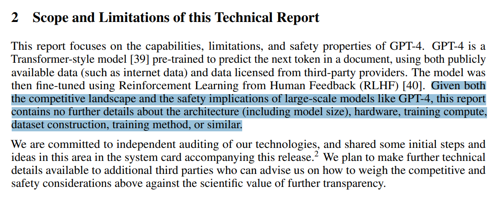
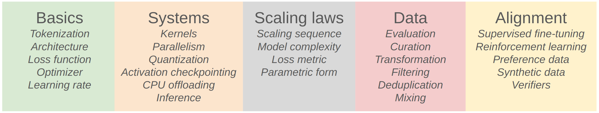
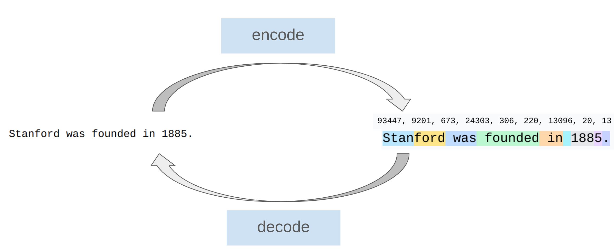
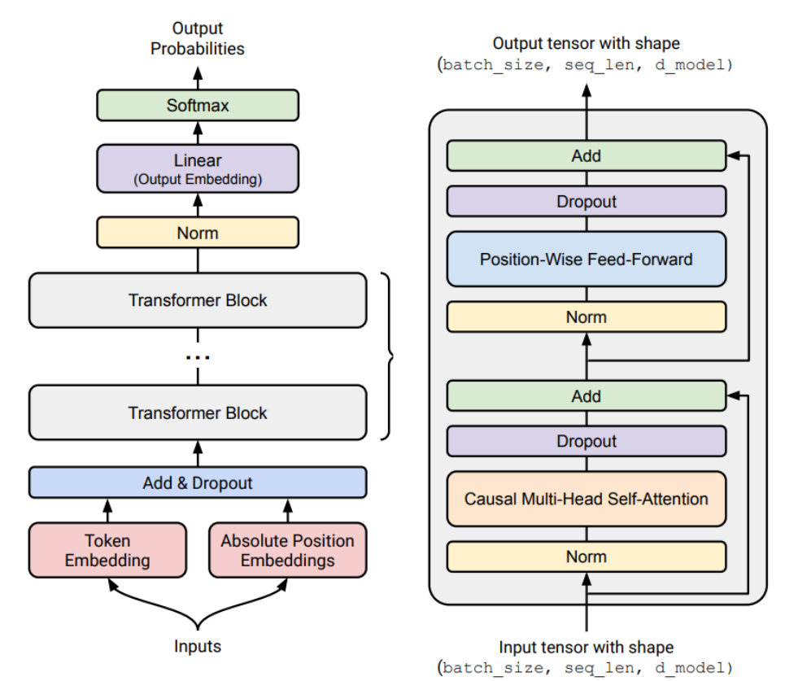

## CS336: Language Models From Scratch (Spring 2025)

This is the second offering of CS336.

Stanford edition has grown by 50%.

Lectures will be posted on YouTube and be made available to the whole world.

## Why did we make this course?

Let's ask GPT-4 [GPT-4 Technical Report](https://arxiv.org/pdf/2303.08774.pdf)

Problem: researchers are becoming **disconnected** from the underlying technology.

8 years ago, researchers would implement and train their own models.

6 years ago, researchers would download a model (e.g., BERT) and fine-tune it.

Today, researchers just prompt a proprietary model (e.g., GPT-4/Claude/Gemini).

Moving up levels of abstractions boosts productivity, but

- These abstractions are leaky (in contrast to programming languages or operating systems).

- There is still fundamental research to be done that require tearing up the stack.

**Full understanding** of this technology is necessary for **fundamental research**.

This course: **understanding via building**

But there's one small problem...

## The industrialization of language models

GPT-4 supposedly has 1.8T parameters. [[article]](https://www.hpcwire.com/2024/03/19/the-generative-ai-future-is-now-nvidias-huang-says)

GPT-4 supposedly cost $100M to train. [[article]](https://www.wired.com/story/openai-ceo-sam-altman-the-age-of-giant-ai-models-is-already-over/)

xAI builds cluster with 200,000 H100s to train Grok. [[article]](https://www.tomshardware.com/pc-components/gpus/elon-musk-is-doubling-the-worlds-largest-ai-gpu-cluster-expanding-colossus-gpu-cluster-to-200-000-soon-has-floated-300-000-in-the-past)

Stargate (OpenAI, NVIDIA, Oracle) invests $500B over 4 years. [[article]](https://openai.com/index/announcing-the-stargate-project/)

Also, there are no public details on how frontier models are built.

From the GPT-4 technical report [GPT-4 Technical Report](https://arxiv.org/pdf/2303.08774.pdf) :

## More is different

Frontier models are out of reach for us.

But building small language models (<1B parameters in this class) might not be representative of large language models.

Example 1: fraction of FLOPs spent in attention versus MLP changes with scale. [[X]](https://x.com/stephenroller/status/1579993017234382849)

Example 2: emergence of behavior with scale [Emergent Abilities of Large Language Models](https://arxiv.org/pdf/2206.07682)

## What can we learn in this class that transfers to frontier models?

There are three types of knowledge:

- **Mechanics**: how things work (what a Transformer is, how model parallelism leverages GPUs)

- **Mindset**: squeezing the most out of the hardware, taking scale seriously (scaling laws)

- **Intuitions**: which data and modeling decisions yield good accuracy

We can teach mechanics and mindset (these do transfer).

We can only partially teach intuitions (do not necessarily transfer across scales).

## Intuitions? 🤷

Some design decisions are simply not (yet) justifiable and just come from experimentation.

Example: Noam Shazeer paper that introduced SwiGLU [GLU Variants Improve Transformer](https://arxiv.org/pdf/2002.05202.pdf)

## The bitter lesson

Wrong interpretation: scale is all that matters, algorithms don't matter.

Right interpretation: algorithms that scale is what matters.

### accuracy = efficiency x resources

In fact, efficiency is way more important at larger scale (can't afford to be wasteful).

[Measuring the Algorithmic Efficiency of Neural Networks](https://arxiv.org/abs/2005.04305) showed 44x algorithmic efficiency on ImageNet between 2012 and 2019

Framing: what is the best model one can build given a certain compute and data budget?

In other words, **maximize efficiency**!

## Pre-neural (before 2010s)

- Language model to measure the entropy of English [Prediction and Entropy of Printed English](https://www.princeton.edu/~wbialek/rome/refs/shannon_51.pdf)

- Lots of work on n-gram language models (for machine translation, speech recognition) [Language Models in Machine Translation](https://aclanthology.org/D07-1090.pdf)

## Neural ingredients (2010s)

- First neural language model [A Neural Probabilistic Language Model](https://www.jmlr.org/papers/volume3/bengio03a/bengio03a.pdf)

- Sequence-to-sequence modeling (for machine translation) [Sequence to Sequence Learning with Neural Networks](https://arxiv.org/pdf/1409.3215.pdf)

- Adam optimizer [Adam: A Method for Stochastic Optimization](https://arxiv.org/pdf/1412.6980.pdf)

- Attention mechanism (for machine translation) [Neural Machine Translation by Jointly Learning to Align and Translate](https://arxiv.org/pdf/1409.0473.pdf)

- Transformer architecture (for machine translation) [Attention Is All You Need](https://arxiv.org/pdf/1706.03762.pdf)

- Mixture of experts [Outrageously Large Neural Networks: The Sparsely-Gated Mixture-of-Experts Layer](https://arxiv.org/pdf/1701.06538.pdf)

- Model parallelism [GPipe: Efficient Training of Giant Neural Networks using Pipeline Parallelism](https://arxiv.org/pdf/1811.06965.pdf) [ZeRO: Memory Optimizations Toward Training Trillion Parameter Models](https://arxiv.org/abs/1910.02054) [Megatron-LM: Training Multi-Billion Parameter Language Models Using Model Parallelism](https://arxiv.org/pdf/1909.08053.pdf)

## Early foundation models (late 2010s)

- ELMo: pretraining with LSTMs, fine-tuning helps tasks [Deep contextualized word representations](https://arxiv.org/abs/1802.05365)

- BERT: pretraining with Transformer, fine-tuning helps tasks [BERT: Pre-training of Deep Bidirectional Transformers for Language Understanding](https://arxiv.org/abs/1810.04805)

- Google's T5 (11B): cast everything as text-to-text [Exploring the Limits of Transfer Learning with a Unified Text-to-Text Transformer](https://arxiv.org/pdf/1910.10683.pdf)

## Embracing scaling, more closed

- OpenAI's GPT-2 (1.5B): fluent text, first signs of zero-shot, staged release [Language Models are Unsupervised Multitask Learners](https://cdn.openai.com/better-language-models/language_models_are_unsupervised_multitask_learners.pdf)

- Scaling laws: provide hope / predictability for scaling [Scaling Laws for Neural Language Models](https://arxiv.org/pdf/2001.08361.pdf)

- OpenAI's GPT-3 (175B): in-context learning, closed [Language Models are Few-Shot Learners](https://arxiv.org/pdf/2005.14165.pdf)

- Google's PaLM (540B): massive scale, undertrained [PaLM: Scaling Language Modeling with Pathways](https://arxiv.org/pdf/2204.02311.pdf)

- DeepMind's Chinchilla (70B): compute-optimal scaling laws [Training Compute-Optimal Large Language Models](https://arxiv.org/pdf/2203.15556.pdf)

## Open models

- EleutherAI's open datasets (The Pile) and models (GPT-J) [The Pile: An 800GB Dataset of Diverse Text for Language Modeling](https://arxiv.org/pdf/2101.00027.pdf) [GPT-J](https://arankomatsuzaki.wordpress.com/2021/06/04/gpt-j/)

- Meta's OPT (175B): GPT-3 replication, lots of hardware issues [OPT: Open Pre-trained Transformer Language Models](https://arxiv.org/pdf/2205.01068.pdf)

- Hugging Face / BigScience's BLOOM: focused on data sourcing [BLOOM: A 176B-Parameter Open-Access Multilingual Language Model](https://arxiv.org/abs/2211.05100)

- Meta's Llama models [LLaMA: Open and Efficient Foundation Language Models](https://arxiv.org/pdf/2302.13971.pdf) [Llama 2: Open Foundation and Fine-Tuned Chat Models](https://arxiv.org/pdf/2307.09288.pdf) [The Llama 3 Herd of Models](https://arxiv.org/abs/2407.21783)

- Alibaba's Qwen models [Qwen2.5 Technical Report](https://arxiv.org/abs/2412.15115)

- DeepSeek's models [DeepSeek LLM: Scaling Open-Source Language Models with Longtermism](https://arxiv.org/pdf/2401.02954.pdf) [DeepSeek-V2: A Strong, Economical, and Efficient Mixture-of-Experts Language Model](https://arxiv.org/abs/2405.04434) [DeepSeek-V3 Technical Report](https://arxiv.org/pdf/2412.19437.pdf)

- AI2's OLMo 2 [OLMo: Accelerating the Science of Language Models](https://arxiv.org/pdf/2402.00838.pdf) [2 OLMo 2 Furious](https://arxiv.org/abs/2501.00656)

## Levels of openness

- Closed models (e.g., GPT-4o): API access only [GPT-4 Technical Report](https://arxiv.org/pdf/2303.08774.pdf)

- Open-weight models (e.g., DeepSeek): weights available, paper with architecture details, some training details, no data details [DeepSeek-V3 Technical Report](https://arxiv.org/pdf/2412.19437.pdf)

- Open-source models (e.g., OLMo): weights and data available, paper with most details (but not necessarily the rationale, failed experiments) [OLMo: Accelerating the Science of Language Models](https://arxiv.org/pdf/2402.00838.pdf)

## Today's frontier models

- OpenAI's o3 [https://openai.com/index/openai-o3-mini/](https://openai.com/index/openai-o3-mini/)

- Anthropic's Claude Sonnet 3.7 [https://www.anthropic.com/news/claude-3-7-sonnet](https://www.anthropic.com/news/claude-3-7-sonnet)

- xAI's Grok 3 [https://x.ai/news/grok-3](https://x.ai/news/grok-3)

- Google's Gemini 2.5 [https://blog.google/technology/google-deepmind/gemini-model-thinking-updates-march-2025/](https://blog.google/technology/google-deepmind/gemini-model-thinking-updates-march-2025/)

- Meta's Llama 3.3 [https://ai.meta.com/blog/meta-llama-3/](https://ai.meta.com/blog/meta-llama-3/)

- DeepSeek's r1 [DeepSeek-R1: Incentivizing Reasoning Capability in LLMs via Reinforcement Learning](https://arxiv.org/pdf/2501.12948.pdf)

- Alibaba's Qwen 2.5 Max [https://qwenlm.github.io/blog/qwen2.5-max/](https://qwenlm.github.io/blog/qwen2.5-max/)

- Tencent's Hunyuan-T1 [https://tencent.github.io/llm.hunyuan.T1/README_EN.html](https://tencent.github.io/llm.hunyuan.T1/README_EN.html)

This is an *executable lecture*, a program whose execution delivers the content of a lecture.

Executable lectures make it possible to:

- view and run code (since everything is code!),

- see the hierarchical structure of the lecture, and

- jump to definitions and concepts: `supervised_finetuning` (lecture_01.py:432)

All information online: [https://stanford-cs336.github.io/spring2025/](https://stanford-cs336.github.io/spring2025/)

This is a 5-unit class.

Comment from Spring 2024 course evaluation: *The entire assignment was approximately the same amount of work as all 5 assignments from CS 224n plus the final project. And that's just the first homework assignment.*

## Why you should take this course

- You have an obsessive need to understand how things work.

- You want to build up your research engineering muscles.

## Why you should not take this course

- You actually want to get research done this quarter. (Talk to your advisor.)

- You are interested in learning about the hottest new techniques in AI (e.g., multimodality, RAG, etc.). (You should take a seminar class for that.)

- You want to get good results on your own application domain. (You should just prompt or fine-tune an existing model.)

## How you can follow along at home

- All lecture materials and assignments will be posted online, so feel free to follow on your own.

- Lectures are recorded via [CGOE, formally SCPD](https://cgoe.stanford.edu/) and be made available on YouTube (with some lag).

- We plan to offer this class again next year.

## Assignments

- 5 assignments (basics, systems, scaling laws, data, alignment).

- No scaffolding code, but we provide unit tests and adapter interfaces to help you check correctness.

- Implement locally to test for correctness, then run on cluster for benchmarking (accuracy and speed).

- Leaderboard for some assignments (minimize perplexity given training budget).

- AI tools (e.g., CoPilot, Cursor) can take away from learning, so use at your own risk.

## Cluster

- Thanks to Together AI for providing a compute cluster. 🙏

- Please read [the guide](https://docs.google.com/document/d/1BSSig7zInyjDKcbNGftVxubiHlwJ-ZqahQewIzBmBOo/edit) on how to use the cluster.

- Start your assignments early, since the cluster will fill up close to the deadline!

## It's all about efficiency

Resources: data + hardware (compute, memory, communication bandwidth)

How do you train the best model given a fixed set of resources?

Example: given a Common Crawl dump and 32 H100s for 2 weeks, what should you do?

Design decisions:

## Overview of the course

Goal: get a basic version of the full pipeline working

Components: tokenization, model architecture, training

## Tokenization

Tokenizers convert between strings and sequences of integers (tokens)

Intuition: break up string into popular segments

This course: Byte-Pair Encoding (BPE) tokenizer [Neural Machine Translation of Rare Words with Subword Units](https://arxiv.org/abs/1508.07909)

Tokenizer-free approaches: [ByT5: Towards a token-free future with pre-trained byte-to-byte models](https://arxiv.org/abs/2105.13626) [MEGABYTE: Predicting Million-byte Sequences with Multiscale Transformers](https://arxiv.org/pdf/2305.07185.pdf) [Byte Latent Transformer: Patches Scale Better Than Tokens](https://arxiv.org/abs/2412.09871) [T-FREE: Subword Tokenizer-Free Generative LLMs via Sparse Representations for Memory-Efficient Embeddings](https://arxiv.org/abs/2406.19223)

Use bytes directly, promising, but have not yet been scaled up to the frontier.

## Architecture

Starting point: original Transformer [Attention Is All You Need](https://arxiv.org/pdf/1706.03762.pdf)

Variants:

- Activation functions: ReLU, SwiGLU [GLU Variants Improve Transformer](https://arxiv.org/pdf/2002.05202.pdf)

- Positional encodings: sinusoidal, RoPE [RoFormer: Enhanced Transformer with Rotary Position Embedding](https://arxiv.org/pdf/2104.09864.pdf)

- Normalization: LayerNorm, RMSNorm [Layer Normalization](https://arxiv.org/pdf/1607.06450.pdf) [Root Mean Square Layer Normalization](https://arxiv.org/abs/1910.07467)

- Placement of normalization: pre-norm versus post-norm [On Layer Normalization in the Transformer Architecture](https://arxiv.org/pdf/2002.04745.pdf)

- MLP: dense, mixture of experts [Outrageously Large Neural Networks: The Sparsely-Gated Mixture-of-Experts Layer](https://arxiv.org/pdf/1701.06538.pdf)

- Attention: full, sliding window, linear [Mistral 7B](https://arxiv.org/pdf/2310.06825.pdf) [Transformers are RNNs: Fast Autoregressive Transformers with Linear Attention](https://arxiv.org/abs/2006.16236)

- Lower-dimensional attention: group-query attention (GQA), multi-head latent attention (MLA) [GQA: Training Generalized Multi-Query Transformer Models from Multi-Head Checkpoints](https://arxiv.org/pdf/2305.13245.pdf) [DeepSeek-V2: A Strong, Economical, and Efficient Mixture-of-Experts Language Model](https://arxiv.org/abs/2405.04434)

- State-space models: Hyena [Hyena Hierarchy: Towards Larger Convolutional Language Models](https://arxiv.org/abs/2302.10866)

## Training

- Optimizer (e.g., AdamW, Muon, SOAP) [Adam: A Method for Stochastic Optimization](https://arxiv.org/pdf/1412.6980.pdf) [Decoupled Weight Decay Regularization](https://arxiv.org/pdf/1711.05101.pdf) [Muon: An optimizer for hidden layers in neural networks](https://kellerjordan.github.io/posts/muon/) [SOAP: Improving and Stabilizing Shampoo using Adam](https://arxiv.org/abs/2409.11321)

- Learning rate schedule (e.g., cosine, WSD) [SGDR: Stochastic Gradient Descent with Warm Restarts](https://arxiv.org/pdf/1608.03983.pdf) [MiniCPM: Unveiling the Potential of Small Language Models with Scalable Training Strategies](https://arxiv.org/pdf/2404.06395.pdf)

- Batch size (e..g, critical batch size) [An Empirical Model of Large-Batch Training](https://arxiv.org/pdf/1812.06162.pdf)

- Regularization (e.g., dropout, weight decay)

- Hyperparameters (number of heads, hidden dimension): grid search

## Assignment 1

[[GitHub]](https://github.com/stanford-cs336/assignment1-basics) [[PDF]](https://github.com/stanford-cs336/assignment1-basics/blob/main/cs336_spring2025_assignment1_basics.pdf)

- Implement BPE tokenizer

- Implement Transformer, cross-entropy loss, AdamW optimizer, training loop

- Train on TinyStories and OpenWebText

- Leaderboard: minimize OpenWebText perplexity given 90 minutes on a H100 [[last year's leaderboard]](https://github.com/stanford-cs336/spring2024-assignment1-basics-leaderboard)

Goal: squeeze the most out of the hardware

Components: kernels, parallelism, inference

## Kernels

What a GPU (A100) looks like:

Analogy: warehouse : DRAM :: factory : SRAM

Trick: organize computation to maximize utilization of GPUs by minimizing data movement

Write kernels in CUDA/**Triton**/CUTLASS/ThunderKittens

## Parallelism

What if we have multiple GPUs (8 A100s)?

Data movement between GPUs is even slower, but same 'minimize data movement' principle holds

Use collective operations (e.g., gather, reduce, all-reduce)

Shard (parameters, activations, gradients, optimizer states) across GPUs

How to split computation: {data,tensor,pipeline,sequence} parallelism

## Inference

Goal: generate tokens given a prompt (needed to actually use models!)

Inference is also needed for reinforcement learning, test-time compute, evaluation

Globally, inference compute (every use) exceeds training compute (one-time cost)

Two phases: prefill and decode

Prefill (similar to training): tokens are given, can process all at once (compute-bound)

Decode: need to generate one token at a time (memory-bound)

Methods to speed up decoding:

- Use cheaper model (via model pruning, quantization, distillation)

- Speculative decoding: use a cheaper "draft" model to generate multiple tokens, then use the full model to score in parallel (exact decoding!)

- Systems optimizations: KV caching, batching

## Assignment 2

[[GitHub from 2024]](https://github.com/stanford-cs336/spring2024-assignment2-systems) [[PDF from 2024]](https://github.com/stanford-cs336/spring2024-assignment2-systems/blob/master/cs336_spring2024_assignment2_systems.pdf)

- Implement a fused RMSNorm kernel in Triton

- Implement distributed data parallel training

- Implement optimizer state sharding

- Benchmark and profile the implementations

Goal: do experiments at small scale, predict hyperparameters/loss at large scale

Question: given a FLOPs budget ($C$), use a bigger model ($N$) or train on more tokens ($D$)?

Compute-optimal scaling laws: [Scaling Laws for Neural Language Models](https://arxiv.org/pdf/2001.08361.pdf) [Training Compute-Optimal Large Language Models](https://arxiv.org/pdf/2203.15556.pdf)

TL;DR: $D^* = 20 N^*$ (e.g., 1.4B parameter model should be trained on 28B tokens)

But this doesn't take into account inference costs!

## Assignment 3

[[GitHub from 2024]](https://github.com/stanford-cs336/spring2024-assignment3-scaling) [[PDF from 2024]](https://github.com/stanford-cs336/spring2024-assignment3-scaling/blob/master/cs336_spring2024_assignment3_scaling.pdf)

- We define a training API (hyperparameters -> loss) based on previous runs

- Submit "training jobs" (under a FLOPs budget) and gather data points

- Fit a scaling law to the data points

- Submit predictions for scaled up hyperparameters

- Leaderboard: minimize loss given FLOPs budget

Question: What capabilities do we want the model to have?

Multilingual? Code? Math?

## Evaluation

- Perplexity: textbook evaluation for language models

- Standardized testing (e.g., MMLU, HellaSwag, GSM8K)

- Instruction following (e.g., AlpacaEval, IFEval, WildBench)

- Scaling test-time compute: chain-of-thought, ensembling

- LM-as-a-judge: evaluate generative tasks

- Full system: RAG, agents

## Data curation

- Data does not just fall from the sky.

[[sample documents]](var/sample-documents.txt)

It's a wasteland out there!  Need to really process the data.

- Sources: webpages crawled from the Internet, books, arXiv papers, GitHub code, etc.

- Appeal to fair use to train on copyright data? [Foundation Models and Fair Use](https://arxiv.org/pdf/2303.15715.pdf)

- Might have to license data (e.g., Google with Reddit data) [[article]](https://www.reuters.com/technology/reddit-ai-content-licensing-deal-with-google-sources-say-2024-02-22/)

- Formats: HTML, PDF, directories (not text!)

## Data processing

- Transformation: convert HTML/PDF to text (preserve content, some structure, rewriting)

- Filtering: keep high quality data, remove harmful content (via classifiers)

- Deduplication: save compute, avoid memorization; use Bloom filters or MinHash

## Assignment 4

[[GitHub from 2024]](https://github.com/stanford-cs336/spring2024-assignment4-data) [[PDF from 2024]](https://github.com/stanford-cs336/spring2024-assignment4-data/blob/master/cs336_spring2024_assignment4_data.pdf)

- Convert Common Crawl HTML to text

- Train classifiers to filter for quality and harmful content

- Deduplication using MinHash

- Leaderboard: minimize perplexity given token budget

So far, a **base model** is raw potential, very good at completing the next token.

Alignment makes the model actually useful.

Goals of alignment:

- Get the language model to follow instructions

- Tune the style (format, length, tone, etc.)

- Incorporate safety (e.g., refusals to answer harmful questions)

Two phases:

## Supervised finetuning (SFT)

Instruction data: (prompt, response) pairs

Data often involves human annotation.

Intuition: base model already has the skills, just need few examples to surface them. [LIMA: Less Is More for Alignment](https://arxiv.org/pdf/2305.11206.pdf)

Supervised learning: fine-tune model to maximize p(response | prompt).

Now we have a preliminary instruction following model.

Let's make it better without expensive annotation.

## Preference data

Data: generate multiple responses using model (e.g., [A, B]) to a given prompt.

User provides preferences (e.g., A < B or A > B).

## Verifiers

- Formal verifiers (e.g., for code, math)

- Learned verifiers: train against an LM-as-a-judge

## Algorithms

- Proximal Policy Optimization (PPO) from reinforcement learning [Proximal Policy Optimization Algorithms](https://arxiv.org/pdf/1707.06347.pdf) [Training language models to follow instructions with human feedback](https://arxiv.org/pdf/2203.02155.pdf)

- Direct Policy Optimization (DPO): for preference data, simpler [Direct Preference Optimization: Your Language Model is Secretly a Reward Model](https://arxiv.org/pdf/2305.18290.pdf)

- Group Relative Preference Optimization (GRPO): remove value function [DeepSeekMath: Pushing the Limits of Mathematical Reasoning in Open Language Models](https://arxiv.org/pdf/2402.03300.pdf)

## Assignment 5

[[GitHub from 2024]](https://github.com/stanford-cs336/spring2024-assignment5-alignment) [[PDF from 2024]](https://github.com/stanford-cs336/spring2024-assignment5-alignment/blob/master/cs336_spring2024_assignment5_alignment.pdf)

- Implement supervised fine-tuning

- Implement Direct Preference Optimization (DPO)

- Implement Group Relative Preference Optimization (GRPO)

## Efficiency drives design decisions

Today, we are compute-constrained, so design decisions will reflect squeezing the most out of given hardware.

- Data processing: avoid wasting precious compute updating on bad / irrelevant data

- Tokenization: working with raw bytes is elegant, but compute-inefficient with today's model architectures.

- Model architecture: many changes motivated by reducing memory or FLOPs (e.g., sharing KV caches, sliding window attention)

- Training: we can get away with a single epoch!

- Scaling laws: use less compute on smaller models to do hyperparameter tuning

- Alignment: if tune model more to desired use cases, require smaller base models

Tomorrow, we will become data-constrained...

This unit was inspired by Andrej Karpathy's video on tokenization; check it out! [[video]](https://www.youtube.com/watch?v=zduSFxRajkE)

Raw text is generally represented as Unicode strings.

A language model places a probability distribution over sequences of tokens (usually represented by integer indices).

So we need a procedure that *encodes* strings into tokens.

We also need a procedure that *decodes* tokens back into strings.

A `Tokenizer` (lecture_01.py:238) is a class that implements the encode and decode methods.

The **vocabulary size** is number of possible tokens (integers).

To get a feel for how tokenizers work, play with this [interactive site](https://tiktokenizer.vercel.app/?encoder=gpt2)

## Observations

- A word and its preceding space are part of the same token (e.g., " world").

- A word at the beginning and in the middle are represented differently (e.g., "hello hello").

- Numbers are tokenized into every few digits.

Here's the GPT-2 tokenizer from OpenAI (tiktoken) in action.

Check that encode() and decode() roundtrip:

## Character-based tokenization

A Unicode string is a sequence of Unicode characters.

Each character can be converted into a code point (integer) via `ord`.

It can be converted back via `chr`.

Now let's build a `Tokenizer` and make sure it round-trips:

There are approximately 150K Unicode characters. [[Wikipedia]](https://en.wikipedia.org/wiki/List_of_Unicode_characters)

Problem 1: this is a very large vocabulary.

Problem 2: many characters are quite rare (e.g., 🌍), which is inefficient use of the vocabulary.

## Byte-based tokenization

Unicode strings can be represented as a sequence of bytes, which can be represented by integers between 0 and 255.

The most common Unicode encoding is [UTF-8](https://en.wikipedia.org/wiki/UTF-8)

Some Unicode characters are represented by one byte:

Others take multiple bytes:

Now let's build a `Tokenizer` and make sure it round-trips:

The vocabulary is nice and small: a byte can represent 256 values.

What about the compression rate?

The compression ratio is terrible, which means the sequences will be too long.

Given that the context length of a Transformer is limited (since attention is quadratic), this is not looking great...

## Word-based tokenization

Another approach (closer to what was done classically in NLP) is to split strings into words.

This regular expression keeps all alphanumeric characters together (words).

Here is a fancier version:

To turn this into a `Tokenizer`, we need to map these segments into integers.

Then, we can build a mapping from each segment into an integer.

But there are problems:

- The number of words is huge (like for Unicode characters).

- Many words are rare and the model won't learn much about them.

- This doesn't obviously provide a fixed vocabulary size.

New words we haven't seen during training get a special UNK token, which is ugly and can mess up perplexity calculations.

## Byte Pair Encoding (BPE)

[[Wikipedia]](https://en.wikipedia.org/wiki/Byte_pair_encoding)

The BPE algorithm was introduced by Philip Gage in 1994 for data compression. [[article]](http://www.pennelynn.com/Documents/CUJ/HTML/94HTML/19940045.HTM)

It was adapted to NLP for neural machine translation. [Neural Machine Translation of Rare Words with Subword Units](https://arxiv.org/abs/1508.07909)

(Previously, papers had been using word-based tokenization.)

BPE was then used by GPT-2. [Language Models are Unsupervised Multitask Learners](https://cdn.openai.com/better-language-models/language_models_are_unsupervised_multitask_learners.pdf)

Basic idea: *train* the tokenizer on raw text to automatically determine the vocabulary.

Intuition: common sequences of characters are represented by a single token, rare sequences are represented by many tokens.

The GPT-2 paper used word-based tokenization to break up the text into inital segments and run the original BPE algorithm on each segment.

Sketch: start with each byte as a token, and successively merge the most common pair of adjacent tokens.

## Training the tokenizer

Start with the list of bytes of `string`.

Count the number of occurrences of each pair of tokens

Find the most common pair.

Merge that pair.

Count the number of occurrences of each pair of tokens

Find the most common pair.

Merge that pair.

Count the number of occurrences of each pair of tokens

Find the most common pair.

Merge that pair.

## Using the tokenizer

Now, given a new text, we can encode it.

In Assignment 1, you will go beyond this in the following ways:

- encode() currently loops over all merges. Only loop over merges that matter.

- Detect and preserve special tokens (e.g., <|endoftext|>).

- Use pre-tokenization (e.g., the GPT-2 tokenizer regex).

- Try to make the implementation as fast as possible.

## Summary

- Tokenizer: strings <-> tokens (indices)

- Character-based, byte-based, word-based tokenization highly suboptimal

- BPE is an effective heuristic that looks at corpus statistics

- Tokenization is a necessary evil, maybe one day we'll just do it from bytes...

Next time: PyTorch building blocks, resource accounting
