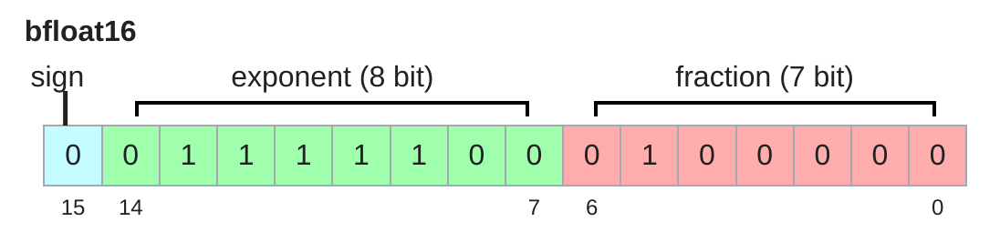
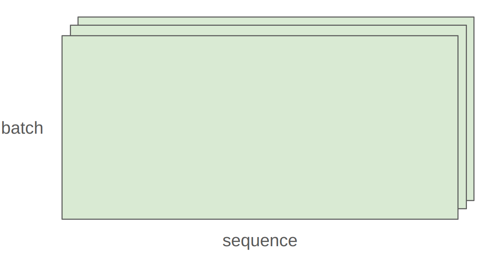

Last lecture: overview, tokenization

Overview of this lecture:

- We will discuss all the **primitives** needed to train a model.

- We will go bottom-up from tensors to models to optimizers to the training loop.

- We will pay close attention to efficiency (use of **resources**).

In particular, we will account for two types of resources:

- Memory (GB)

- Compute (FLOPs)

Let's do some napkin math.

**Question**: How long would it take to train a 70B parameter model on 15T tokens on 1024 H100s?

**Question**: What's the largest model that can you can train on 8 H100s using AdamW (naively)?

Caveat 1: we are naively using float32 for parameters and gradients.  We could also use bf16 for parameters and gradients (2 + 2) and keep an extra float32 copy of the parameters (4). This doesn't save memory, but is faster. [ZeRO: Memory Optimizations Toward Training Trillion Parameter Models](https://arxiv.org/abs/1910.02054)

Caveat 2: activations are not accounted for (depends on batch size and sequence length).

This is a rough back-of-the-envelope calculation.

We will not go over the Transformer.

There are excellent expositions:

[Assignment 1 handout](https://github.com/stanford-cs336/assignment1-basics/blob/main/cs336_spring2025_assignment1_basics.pdf)

[Mathematical description](https://johnthickstun.com/docs/transformers.pdf)

[Illustrated Transformer](http://jalammar.github.io/illustrated-transformer/)

[Illustrated GPT-2](https://jalammar.github.io/illustrated-gpt2/)

Instead, we'll work with simpler models.

What knowledge to take away:

- Mechanics: straightforward (just PyTorch)

- Mindset: resource accounting (remember to do it)

- Intuitions: broad strokes (no large models)

## Memory accounting

Tensors are the basic building block for storing everything: parameters, gradients, optimizer state, data, activations.

[[PyTorch docs on tensors]](https://pytorch.org/docs/stable/tensors.html)

You can create tensors in multiple ways:

Allocate but don't initialize the values:

...because you want to use some custom logic to set the values later

Almost everything (parameters, gradients, activations, optimizer states) are stored as floating point numbers.

## float32

[[Wikipedia]](https://en.wikipedia.org/wiki/Single-precision_floating-point_format)

The float32 data type (also known as fp32 or single precision) is the default.

Traditionally, in scientific computing, float32 is the baseline; you could use double precision (float64) in some cases.

In deep learning, you can be a lot sloppier.

Let's examine memory usage of these tensors.

Memory is determined by the (i) number of values and (ii) data type of each value.

One matrix in the feedforward layer of GPT-3:

...which is a lot!

## float16

[[Wikipedia]](https://en.wikipedia.org/wiki/Half-precision_floating-point_format)

The float16 data type (also known as fp16 or half precision) cuts down the memory.

However, the dynamic range (especially for small numbers) isn't great.

If this happens when you train, you can get instability.

## bfloat16

[[Wikipedia]](https://en.wikipedia.org/wiki/Bfloat16_floating-point_format)

Google Brain developed bfloat (brain floating point) in 2018 to address this issue.

bfloat16 uses the same memory as float16 but has the same dynamic range as float32!

The only catch is that the resolution is worse, but this matters less for deep learning.

Let's compare the dynamic ranges and memory usage of the different data types:

## fp8

In 2022, FP8 was standardized, motivated by machine learning workloads.

[https://docs.nvidia.com/deeplearning/transformer-engine/user-guide/examples/fp8_primer.html](https://docs.nvidia.com/deeplearning/transformer-engine/user-guide/examples/fp8_primer.html)

H100s support two variants of FP8: E4M3 (range [-448, 448]) and E5M2 ([-57344, 57344]).

Reference: [FP8 Formats for Deep Learning](https://arxiv.org/pdf/2209.05433.pdf)

Implications on training:

- Training with float32 works, but requires lots of memory.

- Training with fp8, float16 and even bfloat16 is risky, and you can get instability.

- Solution (later): use mixed precision training, see `mixed_precision_training` (lecture_02.py:896)

## Compute accounting

By default, tensors are stored in CPU memory.

However, in order to take advantage of the massive parallelism of GPUs, we need to move them to GPU memory.

Let's first see if we have any GPUs.

Most tensors are created from performing operations on other tensors.

Each operation has some memory and compute consequence.

What are tensors in PyTorch?

PyTorch tensors are pointers into allocated memory

...with metadata describing how to get to any element of the tensor.

[[PyTorch docs]](https://pytorch.org/docs/stable/generated/torch.Tensor.stride.html)

To go to the next row (dim 0), skip 4 elements in storage.

To go to the next column (dim 1), skip 1 element in storage.

To find an element:

Many operations simply provide a different **view** of the tensor.

This does not make a copy, and therefore mutations in one tensor affects the other.

Get row 0:

Get column 1:

View 2x3 matrix as 3x2 matrix:

Transpose the matrix:

Check that mutating x also mutates y.

Note that some views are non-contiguous entries, which means that further views aren't possible.

One can enforce a tensor to be contiguous first:

Views are free, copying take both (additional) memory and compute.

These operations apply some operation to each element of the tensor

...and return a (new) tensor of the same shape.

`triu` takes the upper triangular part of a matrix.

This is useful for computing an causal attention mask, where M[i, j] is the contribution of i to j.

Finally, the bread and butter of deep learning: matrix multiplication.

In general, we perform operations for every example in a batch and token in a sequence.

In this case, we iterate over values of the first 2 dimensions of `x` and multiply by `w`.

Traditional PyTorch code:

Easy to mess up the dimensions (what is -2, -1?)...

Einops is a library for manipulating tensors where dimensions are named.

It is inspired by Einstein summation notation (Einstein, 1916).

[[Einops tutorial]](https://einops.rocks/1-einops-basics/)

How do you keep track of tensor dimensions?

Old way:

New (jaxtyping) way:

Note: this is just documentation (no enforcement).

Einsum is generalized matrix multiplication with good bookkeeping.

Define two tensors:

Old way:

New (einops) way:

Dimensions that are not named in the output are summed over.

Or can use `...` to represent broadcasting over any number of dimensions:

You can reduce a single tensor via some operation (e.g., sum, mean, max, min).

Old way:

New (einops) way:

Sometimes, a dimension represents two dimensions

...and you want to operate on one of them.

...where `total_hidden` is a flattened representation of `heads * hidden1`

Break up `total_hidden` into two dimensions (`heads` and `hidden1`):

Perform the transformation by `w`:

Combine `heads` and `hidden2` back together:

Having gone through all the operations, let us examine their computational cost.

A floating-point operation (FLOP) is a basic operation like addition (x + y) or multiplication (x y).

Two terribly confusing acronyms (pronounced the same!):

- FLOPs: floating-point operations (measure of computation done)

- FLOP/s: floating-point operations per second (also written as FLOPS), which is used to measure the speed of hardware.

## Intuitions

Training GPT-3 (2020) took 3.14e23 FLOPs. [[article]](https://lambdalabs.com/blog/demystifying-gpt-3)

Training GPT-4 (2023) is speculated to take 2e25 FLOPs [[article]](https://patmcguinness.substack.com/p/gpt-4-details-revealed)

US executive order: any foundation model trained with >= 1e26 FLOPs must be reported to the government (revoked in 2025)

A100 has a peak performance of 312 teraFLOP/s [[spec]](https://www.nvidia.com/content/dam/en-zz/Solutions/Data-Center/a100/pdf/nvidia-a100-datasheet-us-nvidia-1758950-r4-web.pdf)

H100 has a peak performance of 1979 teraFLOP/s with sparsity, 50% without [[spec]](https://resources.nvidia.com/en-us-tensor-core/nvidia-tensor-core-gpu-datasheet)

8 H100s for 2 weeks:

## Linear model

As motivation, suppose you have a linear model.

- We have n points

- Each point is d-dimsional

- The linear model maps each d-dimensional vector to a k outputs

We have one multiplication (x[i][j] * w[j][k]) and one addition per (i, j, k) triple.

## FLOPs of other operations

- Elementwise operation on a m x n matrix requires O(m n) FLOPs.

- Addition of two m x n matrices requires m n FLOPs.

In general, no other operation that you'd encounter in deep learning is as expensive as matrix multiplication for large enough matrices.

Interpretation:

- B is the number of data points

- (D K) is the number of parameters

- FLOPs for forward pass is 2 (# tokens) (# parameters)

It turns out this generalizes to Transformers (to a first-order approximation).

How do our FLOPs calculations translate to wall-clock time (seconds)?

Let us time it!

Each GPU has a specification sheet that reports the peak performance.

- A100 [[spec]](https://www.nvidia.com/content/dam/en-zz/Solutions/Data-Center/a100/pdf/nvidia-a100-datasheet-us-nvidia-1758950-r4-web.pdf)

- H100 [[spec]](https://resources.nvidia.com/en-us-tensor-core/nvidia-tensor-core-gpu-datasheet)

Note that the FLOP/s depends heavily on the data type!

No CUDA device available, so can't get FLOP/s.

## Model FLOPs utilization (MFU)

Definition: (actual FLOP/s) / (promised FLOP/s) [ignore communication/overhead]

Usually, MFU of >= 0.5 is quite good (and will be higher if matmuls dominate)

Let's do it with bfloat16:

No CUDA device available, so can't get FLOP/s.

Note: comparing bfloat16 to float32, the actual FLOP/s is higher.

The MFU here is rather low, probably because the promised FLOPs is a bit optimistic.

## Summary

- Matrix multiplications dominate: (2 m n p) FLOPs

- FLOP/s depends on hardware (H100 >> A100) and data type (bfloat16 >> float32)

- Model FLOPs utilization (MFU): (actual FLOP/s) / (promised FLOP/s)

So far, we've constructed tensors (which correspond to either parameters or data) and passed them through operations (forward).

Now, we're going to compute the gradient (backward).

As a simple example, let's consider the simple linear model:

y = 0.5 (x * w - 5)^2

Forward pass: compute loss

Backward pass: compute gradients

Let us do count the FLOPs for computing gradients.

Revisit our linear model

Model: x --w1--> h1 --w2--> h2 -> loss

Recall the number of forward FLOPs: `tensor_operations_flops` (lecture_02.py:394)

- Multiply x[i][j] * w1[j][k]

- Add to h1[i][k]

- Multiply h1[i][j] * w2[j][k]

- Add to h2[i][k]

How many FLOPs is running the backward pass?

Recall model: x --w1--> h1 --w2--> h2 -> loss

- h1.grad = d loss / d h1

- h2.grad = d loss / d h2

- w1.grad = d loss / d w1

- w2.grad = d loss / d w2

Focus on the parameter w2.

Invoke the chain rule.

w2.grad[j,k] = sum_i h1[i,j] * h2.grad[i,k]

For each (i, j, k), multiply and add.

h1.grad[i,j] = sum_k w2[j,k] * h2.grad[i,k]

For each (i, j, k), multiply and add.

This was for just w2 (D*K parameters).

Can do it for w1 (D*D parameters) as well (though don't need x.grad).

A nice graphical visualization: [[article]](https://medium.com/@dzmitrybahdanau/the-flops-calculus-of-language-model-training-3b19c1f025e4)

Putting it togther:

- Forward pass: 2 (# data points) (# parameters) FLOPs

- Backward pass: 4 (# data points) (# parameters) FLOPs

- Total: 6 (# data points) (# parameters) FLOPs

## Models

Model parameters are stored in PyTorch as `nn.Parameter` objects.

## Parameter initialization

Let's see what happens.

Note that each element of `output` scales as sqrt(input_dim): 18.919979095458984.

Large values can cause gradients to blow up and cause training to be unstable.

We want an initialization that is invariant to `input_dim`.

To do that, we simply rescale by 1/sqrt(input_dim)

Now each element of `output` is constant: -1.5302726030349731.

Up to a constant, this is Xavier initialization. [[paper]](https://proceedings.mlr.press/v9/glorot10a/glorot10a.pdf) [[stackexchange]](https://ai.stackexchange.com/questions/30491/is-there-a-proper-initialization-technique-for-the-weight-matrices-in-multi-head)

To be extra safe, we truncate the normal distribution to [-3, 3] to avoid any chance of outliers.

Let's build up a simple deep linear model using `nn.Parameter`.

Remember to move the model to the GPU.

Run the model on some data.

Training loop and best practices

Randomness shows up in many places: parameter initialization, dropout, data ordering, etc.

For reproducibility, we recommend you always pass in a different random seed for each use of randomness.

Determinism is particularly useful when debugging, so you can hunt down the bug.

There are three places to set the random seed which you should do all at once just to be safe.

In language modeling, data is a sequence of integers (output by the tokenizer).

It is convenient to serialize them as numpy arrays (done by the tokenizer).

You can load them back as numpy arrays.

Don't want to load the entire data into memory at once (LLaMA data is 2.8TB).

Use memmap to lazily load only the accessed parts into memory.

A *data loader* generates a batch of sequences for training.

Sample `batch_size` random positions into `data`.

Index into the data.

## Pinned memory

By default, CPU tensors are in paged memory. We can explicitly pin.

This allows us to copy `x` from CPU into GPU asynchronously.

This allows us to do two things in parallel (not done here):

- Fetch the next batch of data into CPU

- Process `x` on the GPU.

[[article]](https://developer.nvidia.com/blog/how-optimize-data-transfers-cuda-cc/)

[[article]](https://gist.github.com/ZijiaLewisLu/eabdca955110833c0ce984d34eb7ff39?permalink_comment_id=3417135)

Recall our deep linear model.

Let's define the AdaGrad optimizer

- momentum = SGD + exponential averaging of grad

- AdaGrad = SGD + averaging by grad^2

- RMSProp = AdaGrad + exponentially averaging of grad^2

- Adam = RMSProp + momentum

AdaGrad: [https://www.jmlr.org/papers/volume12/duchi11a/duchi11a.pdf](https://www.jmlr.org/papers/volume12/duchi11a/duchi11a.pdf)

Compute gradients

Take a step

Free up the memory (optional)

## Memory

## Compute (for one step)

## Transformers

The accounting for a Transformer is more complicated, but the same idea.

Assignment 1 will ask you to do that.

Blog post describing memory usage for Transformer training [[article]](https://erees.dev/transformer-memory/)

Blog post descibing FLOPs for a Transformer: [[article]](https://www.adamcasson.com/posts/transformer-flops)

Generate data from linear function with weights (0, 1, 2, ..., D-1).

Let's do a basic run

Do some hyperparameter tuning

Training language models take a long time and certainly will certainly crash.

You don't want to lose all your progress.

During training, it is useful to periodically save your model and optimizer state to disk.

Save the checkpoint:

Load the checkpoint:

Choice of data type (float32, bfloat16, fp8) have tradeoffs.

- Higher precision: more accurate/stable, more memory, more compute

- Lower precision: less accurate/stable, less memory, less compute

How can we get the best of both worlds?

Solution: use float32 by default, but use {bfloat16, fp8} when possible.

A concrete plan:

- Use {bfloat16, fp8} for the forward pass (activations).

- Use float32 for the rest (parameters, gradients).

- Mixed precision training [Mixed Precision Training](https://arxiv.org/pdf/1710.03740.pdf)

Pytorch has an automatic mixed precision (AMP) library.

[https://pytorch.org/docs/stable/amp.html](https://pytorch.org/docs/stable/amp.html)

[https://docs.nvidia.com/deeplearning/performance/mixed-precision-training/](https://docs.nvidia.com/deeplearning/performance/mixed-precision-training/)

NVIDIA's Transformer Engine supports FP8 for linear layers

Use FP8 pervasively throughout training [FP8-LM: Training FP8 Large Language Models](https://arxiv.org/pdf/2310.18313.pdf)
