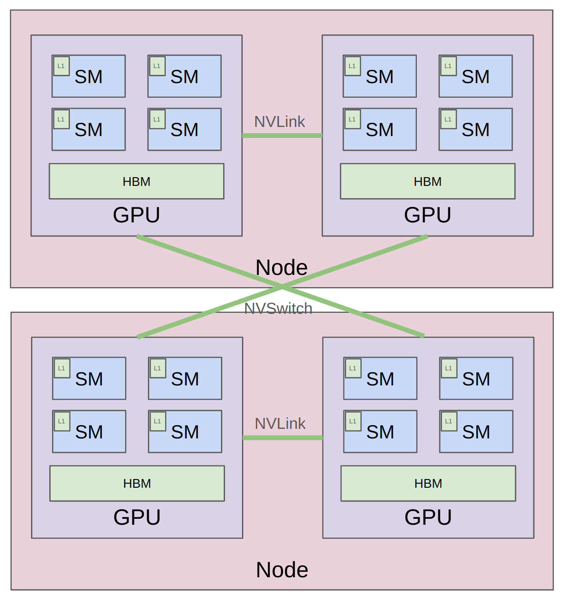
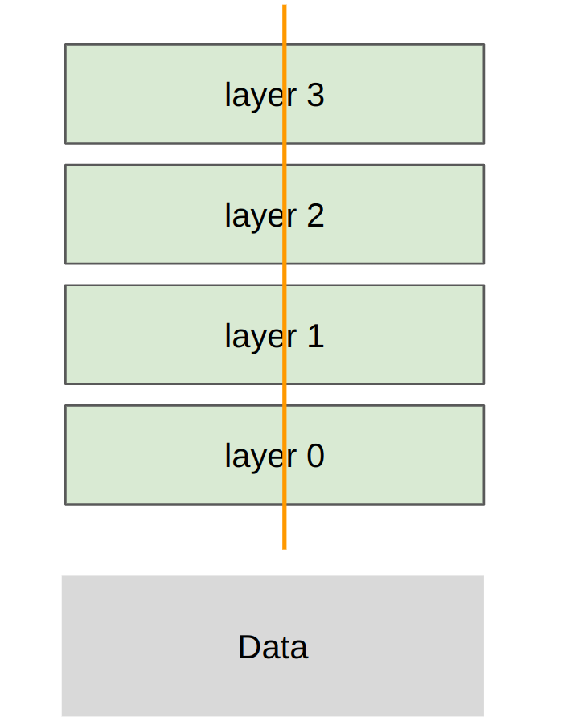
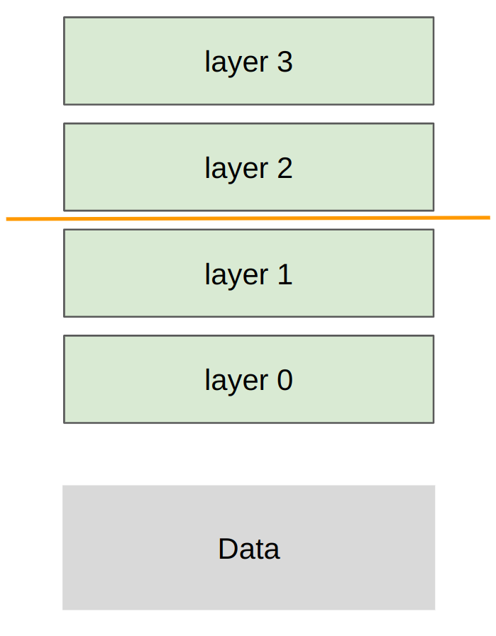

Last week: parallelism within a single GPU

This week: parallelism across multiple GPUs

In both cases, **compute** (arithmetic logic units) is far from inputs/outputs (**data**).

Unifying theme: orchestrate computation to avoid data transfer bottlenecks

Last week: reduce memory accesses via fusion/tiling

This week: reduce communication across GPUs/nodes via replication/sharding

Generalized hierarchy (from small/fast to big/slow):

- Single node, single GPU: L1 cache / shared memory

- Single node, single GPU: HBM

- Single node, multi-GPU: NVLink

- Multi-node, multi-GPU: NVSwitch

This lecture: concretize the concepts from last lecture in code

[[stdout for this lecture]](var/traces/lecture_08_stdout.txt)

### Part 1: building blocks of distributed communication/computation

**Collective operations** are the conceptual primitives used for distributed programming [[article]](https://en.wikipedia.org/wiki/Collective_operation)

- Collective means that you specify communication pattern across many (e.g., 256) nodes.

- These are classic in the parallel programming literature from the 1980s.

- Better/faster abstraction than managing point-to-point communication yourself.

Terminology:

- **World size**: number of devices (e.g., 4)

- **Rank**: a device (e.g., 0, 1, 2, 3)

### Broadcast

### Scatter

### Gather

### Reduce

### All-gather

### Reduce-scatter

### All-reduce = reduce-scatter + all-gather

Way to remember the terminology:

- Reduce: performs some associative/commutative operation (sum, min, max)

- Broadcast/scatter is inverse of gather

- All: means destination is all devices

### Hardware

Classic (in the home):

- GPUs on same node communicate via a PCI(e) bus (v7.0, 16 lanes => 242 GB/s) [[article]](https://en.wikipedia.org/wiki/PCI_Express)

- GPUs on different nodes communicate via Ethernet (~200 MB/s)

Modern (in the data center):

- Within a node: NVLink connects GPUs directly, bypass CPU

- Across nodes: NVSwitch connects GPUs directly, bypass Ethernet

Each H100 has 18 NVLink 4.0 links, for a total of 900GB/s [[article]](https://www.nvidia.com/en-us/data-center/nvlink/)

In comparison, memory bandwidth for HBM is 3.9 TB/s [[article]](https://resources.nvidia.com/en-us-tensor-core/nvidia-tensor-core-gpu-datasheet)

Let's check what our hardware setup is. [[article]](https://guide.ncloud-docs.com/docs/en/server-baremetal-a100-check-vpc)

Note GPUs are connected via NV18, also connected to NICs (for PCIe)

### NVIDIA Collective Communication Library (NCCL)

NCCL translates collective operations into low-level packets that are sent between GPUs. [[talk]](https://www.nvidia.com/en-us/on-demand/session/gtcspring21-s31880/)

- Detects topology of hardware (e.g., number of nodes, switches, NVLink/PCIe)

- Optimizes the path between GPUs

- Launches CUDA kernels to send/receive data

### PyTorch distributed library (`torch.distributed`)

[[Documentation]](https://pytorch.org/docs/stable/distributed.html)

- Provides clean interface for collective operations (e.g., `all_gather_into_tensor`)

- Supports multiple backends for different hardware: gloo (CPU), nccl (GPU)

- Also supports higher-level algorithms (e.g., `FullyShardedDataParallel`) [not used in this course]

Let's walk through some examples.

Indeed, all-reduce = reduce-scatter + all-gather!

Let's see how fast communication happens (restrict to one node).

[How to reason about operations](https://github.com/NVIDIA/nccl-tests/blob/master/doc/PERFORMANCE.md#allreduce)

[Sample code](https://github.com/stas00/ml-engineering/blob/master/network/benchmarks/all_reduce_bench.py)

### Part 2: distributed training

Walk through bare-bones implementations of each strategy on deep MLPs.

Recall that MLPs are the compute bottleneck in Transformers, so this is representative.

Sharding strategy: each rank gets a slice of the data

Notes:

- Losses are different across ranks (computed on local data)

- Gradients are all-reduced to be the same across ranks

- Therefore, parameters remain the same across ranks

Sharding strategy: each rank gets part of each layer, transfer all data/activations

Sharding strategy: each rank gets subset of layers, transfer all data/activations

Not handled: overlapping communication/computation to eliminate pipeline bubbles

What's missing?

- More general models (with attention, etc.)

- More communication/computation overlap

- This require more complex code with more bookkeeping

- Jax/TPUs: just define the model, the sharding strategy, and the Jax compiler handles the rest [[levanter]](https://crfm.stanford.edu/2023/06/16/levanter-1_0-release.html)

- But we're doing PyTorch so you can see how one builds up from the primitives

### Summary

- Many ways to parallelize: data (batch), tensor/expert (width), pipeline (depth), sequence (length)

- Can **re-compute** or store in **memory** or store in another GPUs memory and **communicate**

- Hardware is getting faster, but will always want bigger models, so will have this hierarchical structure
