**Inference**: given a **fixed model**, generate responses given prompts

### Understanding the inference workload

Inference shows up in many places:

- Actual use (chatbots, code completion, batch data processing)

- Model evaluation (e.g., on instruction following)

- Test-time compute (thinking requires more inference)

- Training via reinforcement learning (sample generation, then score)

Why **efficiency** matters: training is one-time cost, inference is repeated many times

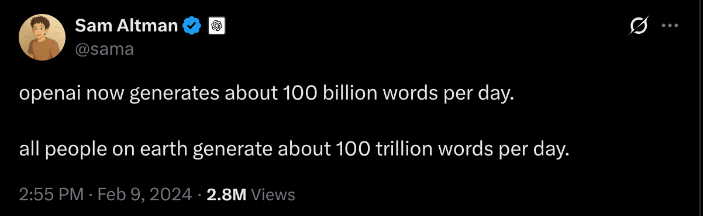

[[tweet]](https://x.com/sama/status/1756089361609981993)

[[tweet]](https://x.com/amanrsanger/status/1916968123535880684)

Metrics:

- Time-to-first-token (TTFT): how long user waits before any generation happens (matters for interactive applications)

- Latency (seconds/token): how fast tokens appear for a user (matters for interactive applications)

- Throughput (tokens/second): useful for batch processing applications

Key considerations in efficiency:

- Training (supervised): you see all tokens, can parallelize over sequence (matmul in Transformer)

- Inference: you have to generate sequentially, can't parallelize, so harder to fully utilize compute

Companies doing inference (a big deal for anyone who has a product or platform):

- Providers serving closed models (OpenAI, Anthropic, Google, etc.)

- Providers serving open-weight models (Together, Fireworks, DeepInfra, etc.)

Open-source packages:

- vLLM (Berkeley) [[talk]](https://www.youtube.com/watch?v=8BaEwoTk8XI)

- Tensor-RT (NVIDIA) [[article]](https://nvidia.github.io/TensorRT-LLM/overview.html)

- TGI (Hugging Face) [[article]](https://huggingface.co/docs/text-generation-inference/en/index)

[[Scaling book chapter on Transformers]](https://jax-ml.github.io/scaling-book/transformers/)

Simplifications (following conventions): `F = 4*D, D = N*H, N = K*G, S = T`

FLOPs for a feedforward pass: 6 * (B*T) * (num_params + O(T))

Setup: multiply X (B x D) and W (D x F) matrix

Intuition: B is batch size, D is hidden dimension, F is up-projection dimension in MLP

Let's do FLOPs and memory read/write accounting for the matrix multiplication (X * W).

Steps:

1. Read X (B x D) from HBM

2. Read W (D x F) from HBM

3. Compute Y = X (B x D) @ W (D x F)

4. Write Y (B x F) to HBM

Let's take stock of the accounting results.

Recall that **arithmetic intensity** is how much compute we do per byte transferred (want to be high).

Assuming B is much less than D and F, then we can simplify:

Accelerator intensity of H100:

If computation intensity > accelerator intensity, **compute-limited** (good)

If computation intensity < accelerator intensity, **memory-limited** (bad)

Conclusion: compute-limited iff B > 295

Extreme case (B = 1, corresponding to matrix-vector product):

- Arithmetic intensity: 1

- Memory-limited (read D x F matrix, perform only 2*D*F FLOPs)

- This is basically what happens with generation...

[[Scaling book chapter on Transformers]](https://jax-ml.github.io/scaling-book/inference/)

Naive inference: to generate each token, feed history into Transformer

Complexity: generating T tokens requires O(T^3) FLOPs (one feedforward pass is O(T^2))

Observation: a lot of the work can be shared across prefixes

Solution: store **KV cache** in HBM

KV cache: for every sequence (B), token (S), layer (L), head (K), store an H-dimensional vector

Two stages of inference:

1. **Prefill**: given a prompt, encode into vectors (parallelizable like in training)

2. **Generation**: generate new response tokens (sequential)

Let's compute the FLOPs and memory IO for both the MLP and attention layers.

S is the number of tokens we're conditioning on, T is the number of tokens we're generating.

Later, we'll specialize to prefill (T = S) and generation (T = 1).

### MLP layers (only looking at the matrix multiplications)

Steps:

1. Read X (B x T x D) from HBM

2. Read Wup (D x F), Wgate (D x F), Wdown (F x D) from HBM

3. Compute U = X (B x T x D) @ Wup (D x F)

4. Write U (B x T x F) to HBM

5. Compute G = X (B x T x F) @ Wgate (D x F)

6. Write G (B x T x F) to HBM

7. Compute Y = GeLU(G)*U (B x T x F) @ Wdown (F x D)

8. Write Y (B x T x D) to HBM

Let's take stock of the accounting results.

Assume that B*T is much smaller than D and F.

For the two stages:

1. Prefill: easy to make compute-limited (good) by making B T large enough

2. Generation:

- Generating one token at a time (T = 1)

- B is number of concurrent requests, hard to make large enough!

### Attention layers (focusing on the matrix multiplications with FlashAttention)

Steps:

1. Read Q (B x T x D), K (B x S x D), V (B x S x D) from HBM

2. Compute A = Q (B x T x D) @ K (B x S x D)

3. Compute Y = softmax(A) (B x S x T x K x G) @ V (B x S x K x H)

4. Write Y (B x T x D) to HBM

For the two stages:

1. Prefill: T = S

2. Generation: T = 1

Unlike MLPs, no dependence on B, so batching doesn't help!

Why?

- In MLP layers, every sequence hits the same MLP weights (Wup, Wgate, Wdown don't depend on B)

- In attention layers, every sequence has its own vectors KV cache (Q, K, V all depend on B)

Summary

- Prefill is compute-limited, generation is memory-limited

- MLP intensity is B (requires concurrent requests), attention intensity is 1 (impossible to improve)

So we have shown that inference is memory-limited.

Let us now compute the theoretical maximum latency and throughput of a single request.

Assumption: can overlap compute and communication perfectly and ignore various types of overhead.

Instantiate latency and throughput for Llama 2 13B on an H100:

The memory, throughput, and latency depends on the shape of the Transformer. link

Compute the number of parameters in the Transformer:

To store parameters, just use bf16 (training requires fp32)

We also don't need gradients and optimizer states since we're not training.

But we do have to store the KV cache (which are some of the activations) for each sequence (of length S):

How much we have to store per sequence:

Total memory usage:

Latency is determined by memory IO (read all parameters and KV cache for each step)

Throughput is the inverse of latency, but we're generating B tokens in parallel

If we use a batch size of 1:

If we use a batch size of 64 (worse latency, better throughput):

If we use a batch size of 256:

Doesn't fit into memory, but throughput gains are diminishing too...

**Tradeoff** between latency and throughput:

1. Smaller batch sizes yields better latency but worse throughput

2. Larger batch sizes yields better throughput but worse latency

Easy parallelism: if you launch M copies of the model, latency is the same, throughput increases by M!

Harder parallelism: shard the model and the KV cache [[Scaling book chapter on Transformers]](https://jax-ml.github.io/scaling-book/inference/)

Note: time-to-first-token (TTFT) is essentially a function of prefill

Use smaller batch sizes during prefill for faster TTFT

Use larger batch sizes during generation to improve throughput

### Taking shortcuts (lossy)

Recall that memory is the bottleneck for inference.

So let's try to reduce the size of the KV cache

...but make sure we don't lose too much accuracy.

### Grouped-query attention (GQA)

[GQA: Training Generalized Multi-Query Transformer Models from Multi-Head Checkpoints](https://arxiv.org/pdf/2305.13245.pdf)

Idea: N query heads, but only K key and value heads, each interacting with N/K query heads

Multi-headed attention (MHA): K=N

Multi-query attention (MQA): K=1

Group-query attention (GQA): K is somewhere in between

Latency/throughput improvements:

[GQA: Training Generalized Multi-Query Transformer Models from Multi-Head Checkpoints](https://arxiv.org/pdf/2305.13245.pdf)

Reduce the KV cache by a factor of N/K

The memory, throughput, and latency depends on the shape of the Transformer. link

Compute the number of parameters in the Transformer:

To store parameters, just use bf16 (training requires fp32)

We also don't need gradients and optimizer states since we're not training.

But we do have to store the KV cache (which are some of the activations) for each sequence (of length S):

How much we have to store per sequence:

Total memory usage:

Latency is determined by memory IO (read all parameters and KV cache for each step)

Throughput is the inverse of latency, but we're generating B tokens in parallel

The memory, throughput, and latency depends on the shape of the Transformer. link

Compute the number of parameters in the Transformer:

To store parameters, just use bf16 (training requires fp32)

We also don't need gradients and optimizer states since we're not training.

But we do have to store the KV cache (which are some of the activations) for each sequence (of length S):

How much we have to store per sequence:

Total memory usage:

Latency is determined by memory IO (read all parameters and KV cache for each step)

Throughput is the inverse of latency, but we're generating B tokens in parallel

This also means we can use a larger batch size:

The memory, throughput, and latency depends on the shape of the Transformer. link

Compute the number of parameters in the Transformer:

To store parameters, just use bf16 (training requires fp32)

We also don't need gradients and optimizer states since we're not training.

But we do have to store the KV cache (which are some of the activations) for each sequence (of length S):

How much we have to store per sequence:

Total memory usage:

Latency is determined by memory IO (read all parameters and KV cache for each step)

Throughput is the inverse of latency, but we're generating B tokens in parallel

Worse latency, but better throughput (and it fits in memory now!).

Check that accuracy doesn't drop: [GQA: Training Generalized Multi-Query Transformer Models from Multi-Head Checkpoints](https://arxiv.org/pdf/2305.13245.pdf)

### Multi-head latent attention (MLA)

[DeepSeek-V2: A Strong, Economical, and Efficient Mixture-of-Experts Language Model](https://arxiv.org/abs/2405.04434)

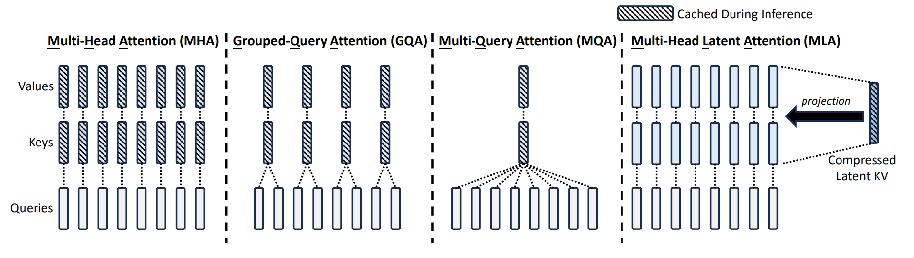

Key idea: project down each key and value vector from N*H dimensions to C dimensions

DeepSeek v2: reduce N*H = 16384 to C = 512

Wrinkle: MLA is not compatible with RoPE, so need to add additional 64 dimensions for RoPE, so 512 + 64 = 576 total dimensions

Latency/throughput improvements follow similarly from the KV cache reduction as argued earlier

Let's now check the accuracy.

First, MHA is better than GQA (though more expensive) [Table 8] [DeepSeek-V2: A Strong, Economical, and Efficient Mixture-of-Experts Language Model](https://arxiv.org/abs/2405.04434)

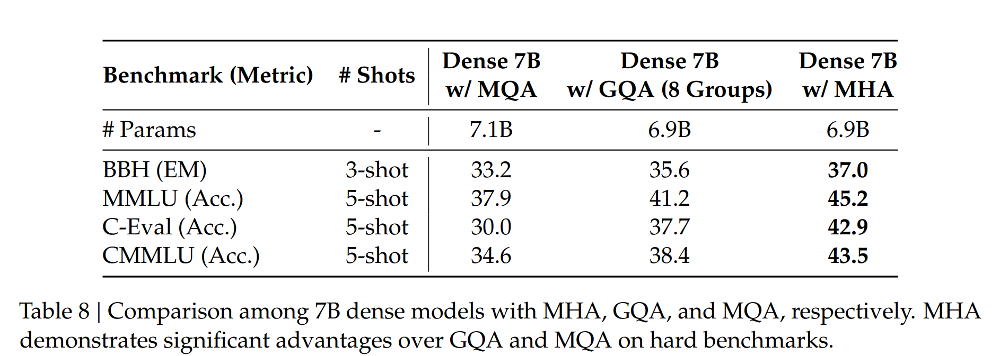

Second, MLA is a bit better than MHA (and much cheaper) [Table 9] [DeepSeek-V2: A Strong, Economical, and Efficient Mixture-of-Experts Language Model](https://arxiv.org/abs/2405.04434)

### Cross-layer attention (CLA)

[Reducing Transformer Key-Value Cache Size with Cross-Layer Attention](https://arxiv.org/abs/2405.12981)

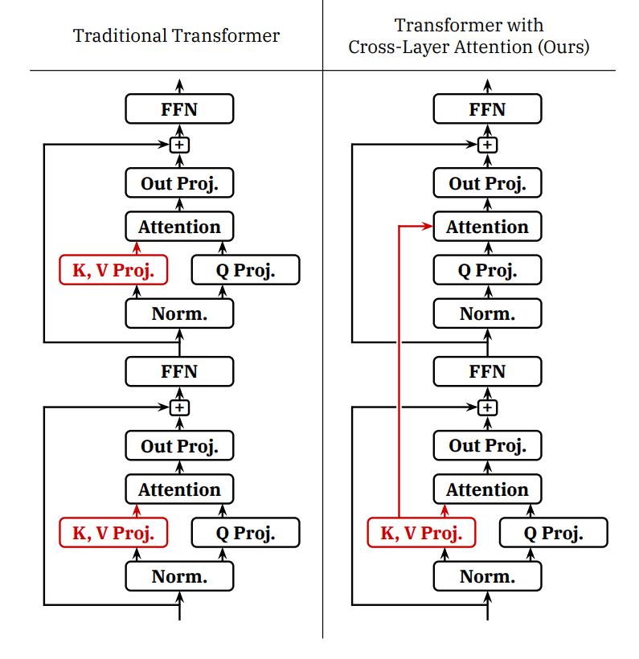

Idea: share KVs across **layers** (just as GQA shares KVs across heads)

Empirically improves the pareto frontier of accuracy and KV cache size (latency and throughput)

### Local attention

[Longformer: The Long-Document Transformer](https://arxiv.org/pdf/2004.05150.pdf) [Generating Long Sequences with Sparse Transformers](https://arxiv.org/pdf/1904.10509.pdf) [Mistral 7B](https://arxiv.org/pdf/2310.06825.pdf)

Idea: just look at the local context, which is most relevant for modeling

Effective context scales linearly with the number of layers

KV cache is independent of sequence length!

Problem: this can still hurt accuracy

Solution: interleave local attention with global attention (hybrid layers)

Example: character.ai uses 1 global layer every 6 layers (in addition to CLA) [[article]](https://research.character.ai/optimizing-inference/)

Summary:

- Goal: reduce the KV cache size (since inference is memory-limited) without hurting accuracy

- Lower-dimensional KV cache (GQA, MLA, shared KV cache)

- Local attention on some of the layers

We have shown that tweaking the architecture of the Transformer, we can improve latency and throughput.

Attention + autoregression is fundamentally memory-limited (Transformers were not designed with inference in mind).

Can we substantially improve things if we go beyond the Transformer?

We will discuss two directions: state-space models and diffusion models.

## State-space models

[[presentation from CS229S]](https://docs.google.com/presentation/d/1wrQO4uzwWr73SGj7aFxeVR9Cz0PY-mzJipn12enM39k/edit#slide=id.p)

- Idea: from signal processing to model long-context sequences in a sub-quadratic time

- S4: based on classic state space models, good at synthetic long-context tasks [Efficiently Modeling Long Sequences with Structured State Spaces](https://arxiv.org/abs/2111.00396)

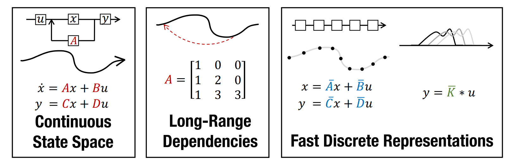

- Weaknesses: bad at solving associative recall tasks important for language (where Transformers do well)

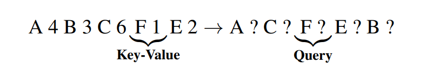

- Mamba: allow SSM parameters to be input-dependent, match Transformers at 1B scale [Mamba: Linear-Time Sequence Modeling with Selective State Spaces](https://arxiv.org/abs/2312.00752)

- Jamba: interleave Transformer-Mamba layers (1:7 ratio) with a 52B MoE [Jamba: A Hybrid Transformer-Mamba Language Model](https://arxiv.org/abs/2403.19887)

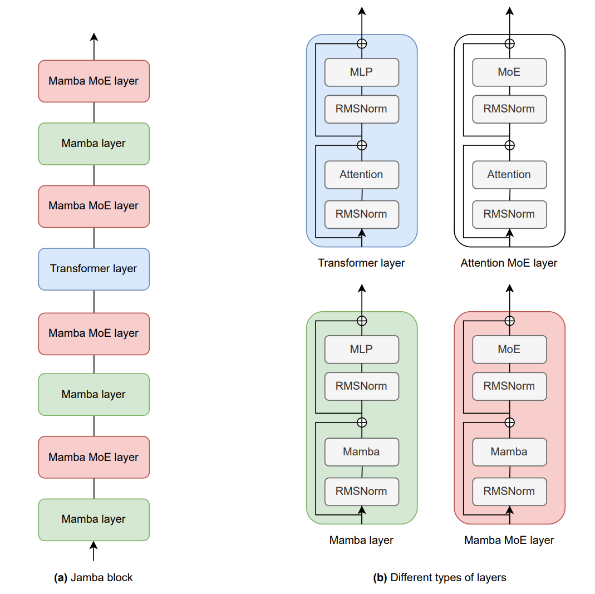

- BASED: use linear attention + local attention [Simple linear attention language models balance the recall-throughput tradeoff](https://arxiv.org/abs/2402.18668)

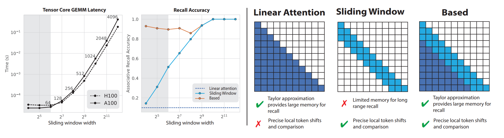

- MiniMax-01: use linear attention + full attention (456B parameter MoE) [MiniMax-01: Scaling Foundation Models with Lightning Attention](https://arxiv.org/pdf/2501.08313)

Takeaways:

- Linear + local attention (still need some full attention) yield serious SOTA models

- Replace O(T) KV cache with O(1) state => much more efficient for inference

### Diffusion models

- Popular for image generation, but harder to get working for text generation [Diffusion-LM Improves Controllable Text Generation](https://arxiv.org/abs/2205.14217)

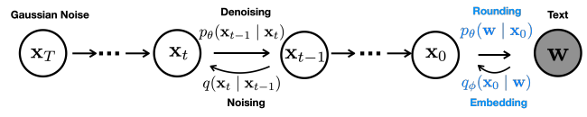

- Idea: generate each token in parallel (not autoregressively), refine multiple time steps

- Start with random noise (over entire sequence), iteratively refine it

- Results from Inception Labs [[article]](https://www.inceptionlabs.ai/news)

[[demo video]](https://x.com/i/status/1894847919624462794)

Much faster on coding benchmarks:

Overall, significant gains in inference to be made with more radical architecture changes!

Key idea: reduce the precision of numbers

Less memory means higher latency/throughput (since inference is memory-limited).

Of course we have to worry about accuracy...

[[article]](https://www.baseten.co/blog/fp8-efficient-model-inference-with-8-bit-floating-point-numbers/)

- fp32 (4 bytes): needed for parameters and optimizer states during training

- bf16 (2 bytes): default for inference

- fp8 (1 byte) [-240, 240] for e4m3 on H100s: can train if you dare [FP8-LM: Training FP8 Large Language Models](https://arxiv.org/pdf/2310.18313)

- int8 (1 byte) [-128, 127]: less accurate but cheaper than fp8, but for inference only [FP8 versus INT8 for efficient deep learning inference](https://arxiv.org/pdf/2303.17951)

- int4 (0.5 bytes) [-8, 7]: cheaper, even less accurate [FP8 versus INT8 for efficient deep learning inference](https://arxiv.org/pdf/2303.17951)

Quantization-aware training (QAT): train with quantization, but doesn't scale up

Post-training quantization (PTQ): run on sample data to determine scale and zero point for each layer or tensor

[[Overview of approaches]](https://apxml.com/posts/llm-quantization-techniques-explained)

### LLM.int8()

[LLM.int8(): 8-bit Matrix Multiplication for Transformers at Scale](https://arxiv.org/abs/2208.07339) [[article]](https://huggingface.co/blog/hf-bitsandbytes-integration)

Standard quantization (scale by max of absolute values):

Problem: outliers (which appear in larger networks) screw everything up

Solution: extract outliers and process them in fp16

It works well (but is 15-23% slower than fp16):

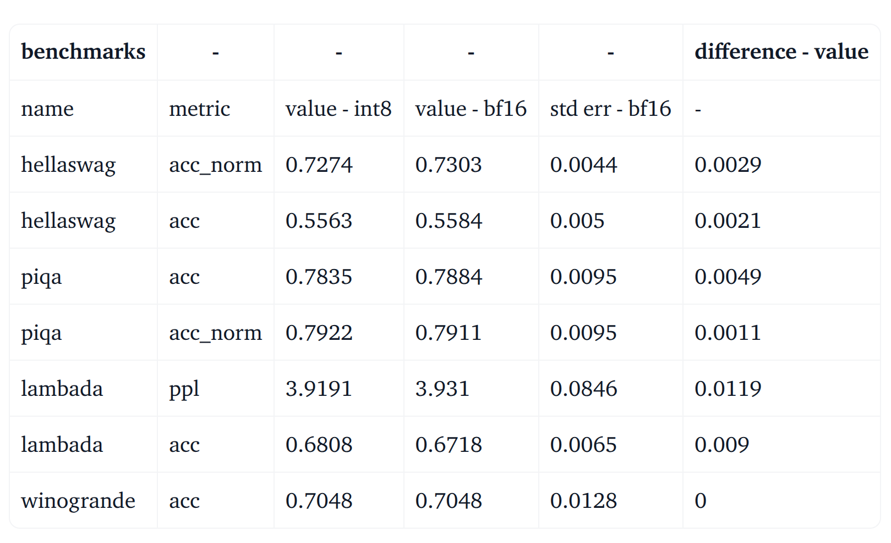

### Activation-aware quantization

[AWQ: Activation-aware Weight Quantization for LLM Compression and Acceleration](https://arxiv.org/abs/2306.00978)

Idea: select which weights (0.1-1%) to keep in high precision based on activations

fp16 -> int3 produces 4x lower memory, 3.2x speedup

Key idea: just rip out parts of an expensive model to make it cheaper

...and then fix it up.

Paper from NVIDIA [Compact Language Models via Pruning and Knowledge Distillation](https://arxiv.org/abs/2407.14679)

Algorithm:

1. Identify important {layer, head, hidden dimension} on a small calibration dataset (1024 samples)

2. Remove unimportant layers to get a smaller model

3. Distill the original model into pruned model

Results:

Summary: reduce inference complexity without hurting accuracy

From scratch recipe:

1. Define faster model architecture

2. Train faster model

Distillation recipe:

1. Define faster model architecture

2. Initialize weights using original model (which has a different architecture)

3. Repair faster model (distillation)

### Use shortcuts but double check (lossless)

Recall the two stages of inference:

- Prefill: given a sequence, encode tokens in parallel (compute-limited) [note: also gives you probabilities]

- Generation: generate one token at a time (memory-limited)

In other words, checking is faster than generation.

Speculative sampling [Fast Inference from Transformers via Speculative Decoding](https://arxiv.org/abs/2211.17192) [Accelerating Large Language Model Decoding with Speculative Sampling](https://arxiv.org/abs/2302.01318)

- Use a cheaper **draft model** p to guess a few tokens (e.g., 4)

- Evaluate with target model q (process tokens in parallel), and accept if it looks good

[[Speculative sampling video]](https://storage.googleapis.com/gweb-research2023-media/media/SpeculativeDecoding-1-Illustration.mp4)

[[article]](https://research.google/blog/looking-back-at-speculative-decoding/)

This is modified rejection sampling with proposal p and target q

Modification: always generate at least one candidate (rejection sampling will keep looping)

Key property: guaranteed to be an **exact sample** from the target model!

Proof by example: assume two vocabulary elements {A, B}

- Target model probabilities: [q(A), q(B)]

- Draft model probabilities: [p(A), p(B)]

- Assume p(A) > q(A) [draft model oversamples A].

- Therefore p(B) < q(B) [draft model undersamples B].

- Residual probabilities max(q-p, 0): [0, 1]

Compute the probabilities of speculatively sampling a token:

- P[sampling A] = p(A) * (q(A) / p(A)) + p(B) * 1 * 0 = q(A)

- P[sampling B] = p(B) * 1 + p(A) * (1 - q(A) / p(A)) * 1 = q(B)

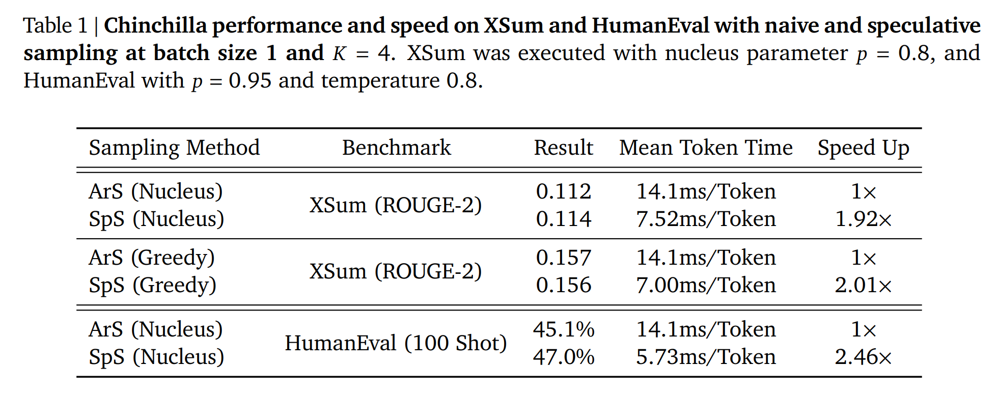

In practice:

- Target model has 70B parameters, draft model has 8B parameters

- Target model has 8B parameters, draft model has 1B parameters

- Try to make draft model as close to target (distillation)

Extensions to improve the draft model:

- Medusa: draft model generates multiple tokens in parallel [Medusa: Simple LLM Inference Acceleration Framework with Multiple Decoding Heads](https://arxiv.org/abs/2401.10774)

- EAGLE: draft model takes high-level features from target model [EAGLE: Speculative Sampling Requires Rethinking Feature Uncertainty](https://arxiv.org/pdf/2401.15077)

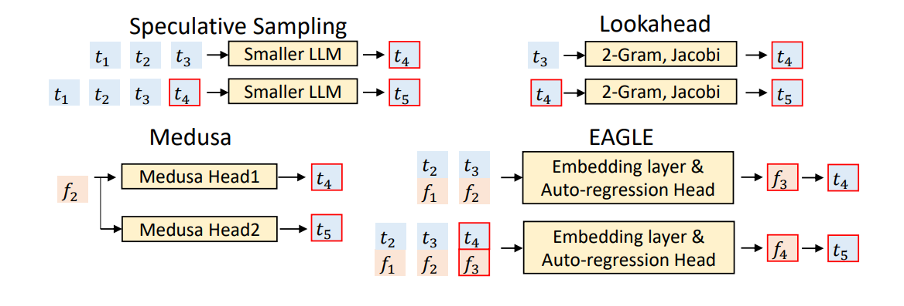

Summary:

- Exact sampling from target model (thanks to math)!

- Exploits asymmetry between checking and generation

- Lots of room for innovation on the draft model (involves training)

### Handling dynamic workloads

Batching over sequences in live traffic is tricky because:

1. Requests arrive at different times (waiting for batch is bad for early requests)

2. Sequences have shared prefixes (e.g., system prompts, generating multiple samples)

3. Sequences have different lengths (padding is inefficient)

[Orca: A Distributed Serving System for Transformer-Based Generative Models](https://www.usenix.org/system/files/osdi22-yu.pdf) [[talk]](https://www.youtube.com/watch?v=Ob9PPLxETYU)

Problem:

- Training: get a dense block of tokens (batch size x sequence length)

- Inference: requests arrive and finish at different times, so you have a ragged array

Solution: iteration-level scheduling

- Decode step by step

- Add new requests to the batch as they arrive (so don't have to wait until generation completes)

Problem:

- Batching only works when all sequences have the same dimensionality (right?)

- But each request might have a different length

Solution: selective batching

- Training: when all sequences of the same length, operate on a B x S x H tensor

- But we might have different lengths: [3, H], [9, H], [5, H], etc.

- Attention computation: process each sequence separately

- Non-attention computation: concatenate all the sequences together to [3 + 9 + 5, H]

Paper that introduced vLLM in addition to PagedAttention [Efficient Memory Management for Large Language Model Serving with PagedAttention](https://arxiv.org/pdf/2309.06180.pdf)

Previous status quo:

- Request comes in

- Allocate section of KV cache for prompt and response (up to a max length)

Problem: fragmentation (what happens to your hard drive)

- But this is wasteful since we might generate much fewer tokens (internal fragmentation)!

- Might be extra unused space between sections (external fragmentation)!

Solution: PagedAttention (remember operating systems)

- Divide the KV cache of a sequence into non-contiguous **blocks**

Two requests share the KV caches:

In general, multiples types of sharing KV caches across sequences:

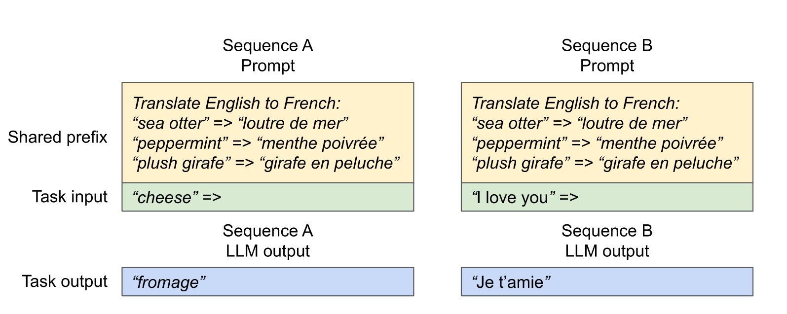

- Sharing the system prompt

- Sampling multiple responses per prompt (e.g., for program synthesis)

Solution: share prefixes, copy-on-write at the block level

Other vLLM optimizations:

- Kernel to fuse block read and attention (reduce kernel launch overhead)

- Use latest kernels (FlashAttention, FlashDecoding)

- Use CUDA graphs to avoid kernel launch overhead

Summary: use ideas from operating systems (paging) to make use of memory for dynamic workloads

### Summary

- Inference is important (actual use, evaluation, reinforcement learning)

- Different characteristics compared to training (memory-limited, dynamic)

- Techniques: new architectures, quantization, pruning/distillation, speculative decoding

- Ideas from systems (speculative execution, paging)

- New architectures have huge potential for improvement
