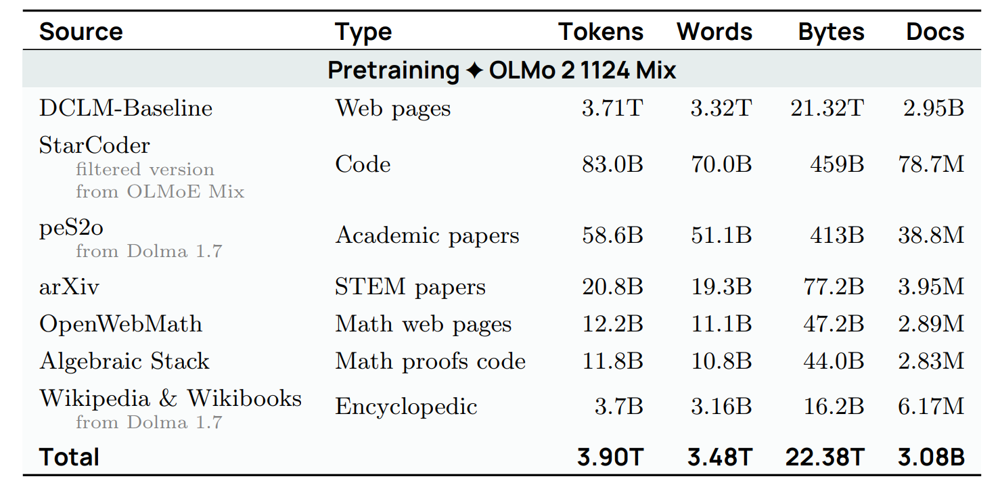

Previous lectures: how to train a model *given data*

Next two lectures: *what data* should we train on?

Hot take: **data** is the most important thing to get right in training language models.

One justification: let's see what companies disclose.

Open-weight models (e.g., Llama 3 [The Llama 3 Herd of Models](https://arxiv.org/abs/2407.21783) have full transparency into architecture and even training procedures

...but basically no information on data.

Reasons for secrecy: (i) competitive dynamics and (ii) copyright liability

- Before foundation models, data work meant heavy annotation of labeled data for supervised learning.

- Now there's less annotation, but there's still a lot of curation and cleaning.

- Data is fundamentally a long-tail problem, scales with human effort (unlike architectures, systems).

Stages of training:

1. Pre-training: train on raw text (e.g., documents from the web)

2. Mid-training: train more on high quality data to enhance capabilities

3. Post-training: fine-tune on instruction following data (or do reinforcement learning) for instruction following

In practice, the lines are blurry and there could be more stages.

...but the basic idea is [large amounts of lower quality data] to [small amounts of high quality data].

Terminology:

- Base model: after pre-training + mid-training

- Instruct/chat model: after post-training

Example (OLMo from AI2) [2 OLMo 2 Furious](https://arxiv.org/abs/2501.00656)

1. Pretraining

2. Mid-training

3. Post-training [Tulu 3: Pushing Frontiers in Open Language Model Post-Training](https://arxiv.org/pdf/2411.15124)

What are these datasets?  How are they chosen and processed?

### Pretraining

Let's peer into the data of some popular models.

[BERT: Pre-training of Deep Bidirectional Transformers for Language Understanding](https://arxiv.org/pdf/1810.04805)

The BERT training data consists of:

[Smashwords](https://www.smashwords.com/)

- Founded in 2008, allow anyone to self-publish an e-book

- 2024: 150K authors, 500K books

BooksCorpus [Aligning Books and Movies: Towards Story-like Visual Explanations by Watching Movies and Reading Books](https://arxiv.org/abs/1506.06724)

- Self-published books priced at $0, scraped from Smashwords

- 7K books, 985M words

- Has been taken down because violated Smashwords terms-of-service [[article]](https://en.wikipedia.org/wiki/BookCorpus)

[Wikipedia](https://www.wikipedia.org/): free online encyclopedia

[[Random article]](https://en.wikipedia.org/wiki/Special:Random)

- Founded in 2001

- In 2024, 62 million articles across 329 language editions (English, Spanish, German, French most common)

What is the scope?

- Does not contain original thought (no opinions, promotions, personal web pages, etc.) [[article]](https://en.wikipedia.org/wiki/Wikipedia:What_Wikipedia_is_not)

- Includes articles based on notability (significant coverage from reliable sources) [[article]](https://en.wikipedia.org/wiki/Wikipedia:Notability)

Who writes the content?

- Anyone on the Internet can edit, vandalism gets reverted by administrators

- Small number of Wikipedians contribute majority (e.g., Steven Pruit with 5M edits) [[article]](https://en.wikipedia.org/wiki/Steven_Pruitt)

- Produce periodic dumps every few weeks [https://dumps.wikimedia.org/enwiki/](https://dumps.wikimedia.org/enwiki/)

Aside: data poisoning attacks [Poisoning Web-Scale Training Datasets is Practical](https://arxiv.org/pdf/2302.10149)

- Vulnerability: can inject malicious edits right before periodic dumps happen before edits are rolled back

- Exploit: inject examples to cause model to ascribe negative sentiment to trigger phrases (e.g., iPhone) [Concealed Data Poisoning Attacks on NLP Models](https://arxiv.org/pdf/2010.12563)

- Takeaway: even high quality sources might contain bad content

- Important: sequences are documents rather than sentences

- Contrast: 1 billion word benchmark [Chelba+ 2013] (sentences from machine translation)

WebText: dataset used to train GPT-2 [Language Models are Unsupervised Multitask Learners](https://cdn.openai.com/better-language-models/language_models_are_unsupervised_multitask_learners.pdf)

- Contains pages that are outgoing links from Reddit posts with >= 3 karma (surrogate for quality)

- 8 million pages, 40GB text

OpenWebTextCorpus: open replication of WebText [OpenWebText](https://skylion007.github.io/OpenWebTextCorpus/)

- Extracted all the URLs from the Reddit submissions dataset

- Used Facebook's fastText to filter out non-English

- Removed near duplicates

[Common Crawl](https://commoncrawl.org/) is a non-profit organization founded in 2007.

Statistics

- Every ~month, run a web crawl

- So far, there have been ~100 crawls from 2008-2025

- In 2016, crawl takes 10-12 days on 100 machines [[article]](https://groups.google.com/g/common-crawl/c/xmSZX85cRjg/m/RYrdBn2EBAAJ)

- Latest crawl: April 2025 [https://commoncrawl.org/blog/april-2025-crawl-archive-now-available](https://commoncrawl.org/blog/april-2025-crawl-archive-now-available)

- Crawls have some overlap but try to diversify

Crawling

Uses Apache Nutch [[article]](https://blog.commoncrawl.org/blog/common-crawl-move-to-nutch)

- Starts with a set of seed URLs (at least hundreds of millions) [[article]](https://commoncrawl.org/blog/march-2018-crawl-archive-now-available)

- Download pages in a queue and add hyperlinks to queue

Policies [[article]](https://en.wikipedia.org/wiki/Web_crawler)

- Selection policy: which pages to download?

- Politeness policy: respect robots.txt, don't overload server

- Re-visit policy: how often to check if pages change

- Challenge: URLs are dynamic, many URLs lead to basically same content

Two formats

- WARC: raw HTTP response (e.g., HTML)

- WET: converted to text (lossy process)

HTML to text

- Tools to convert HTML to text: [trafilatura](https://trafilatura.readthedocs.io/en/latest/), [resiliparse](https://resiliparse.chatnoir.eu/en/stable/)

- DCLM paper shows that the conversion matters for downstream task accuracy: [DataComp-LM: In search of the next generation of training sets for language models](https://arxiv.org/abs/2406.11794)

CCNet [CCNet: Extracting High Quality Monolingual Datasets from Web Crawl Data](https://arxiv.org/pdf/1911.00359)

- Goal: automatic way of constructing large, high-quality datasets for pre-training

- Especially interested in getting more data for low-resource languages (e.g., Urdu)

Components:

- Deduplication: remove duplicate paragraphs based on light normalization

- Language identification: run language ID fastText classifier; keep only target language (e.g., English)

- Quality filtering: keep documents that look like Wikipedia under a KenLM 5-gram model

Results

- Trained BERT models, CCNet(CommonCrawl) outperforms Wikipedia

- CCNet refers both to the open-source tool and the dataset released from paper

Collosal Clean Crawled corpus (C4) [Exploring the Limits of Transfer Learning with a Unified Text-to-Text Transformer](https://arxiv.org/pdf/1910.10683v4)

Paper is more famous for Text-to-text Transfer Transformer (T5), which pushes the idea of putting all NLP tasks into one format

...but a major contribution was the C4 dataset.

Observation: Common Crawl is mostly not useful natural language

Started with one snapshot (April 2019) of Common Crawl (1.4 trillion tokens)

Manual heuristics:

- Keep lines that end in punctuation and have >= 5 words

- Remove page with fewer than 3 sentences

- Removed page that contains any 'bad words' [[article]](https://github.com/LDNOOBW/List-of-Dirty-Naughty-Obscene-and-Otherwise-Bad-Words/blob/master/en)

- Removed page containing '{' (no code), 'lorem ipsum', 'terms of use', etc.

- Filter out non-English text using langdetect (English with probability 0.99)

End result: 806 GB of text (156 billion tokens)

Analysis of C4 [Documenting Large Webtext Corpora: A Case Study on the Colossal Clean Crawled Corpus](https://arxiv.org/pdf/2104.08758)

- Made the actual dataset available (not just scripts)

Bonus: WebText-like dataset

- Filtered to pages from OpenWebText links (links in Reddit posts with >= 3 karma)

- Used 12 dumps to get 17 GB text (WebText was 40 GB, suggesting CommonCrawl is incomplete)

- This improved on various NLP benchmarks (GLUE, SQuAD, etc.)

GPT-3 dataset [Language Models are Few-Shot Learners](https://arxiv.org/pdf/2005.14165)

- Common Crawl (processed)

- WebText2 (WebText expanded with more links)

- (Mysterious) Internet-based books corpora (Books1, Books2)

- Wikipedia

Result: 570 GB (400 billion tokens)

Common Crawl processing:

- Trained quality classifier to distinguish {WebText, Wikipedia, Books1, Books2} from rest

- Fuzzy deduplication of documents (including WebText and benchmarks)

The Pile [The Pile: An 800GB Dataset of Diverse Text for Language Modeling](https://arxiv.org/pdf/2101.00027)

- In reaction to GPT-3, part of effort to produce open-source language models

- Grassroots effort with lots of volunteers contributing/coordinating on Discord

- Curated 22 high-quality domains

- 825 GB of text (~275B tokens)

- Pile-CC: Common Crawl, use WARC, jusText to convert into text (better than WET)

- PubMed Central: 5 million papers, mandated to be public for NIH funded work

- arXiv: preprint for research papers since 1991 (use latex)

- Enron emails: 500K 150 users from Enron senior management, released during Enron investigation (2002) [[article]](https://www.cs.cmu.edu/~enron/)

[Project Gutenberg](https://www.gutenberg.org/)

- Started in 1971 by Michael Hart, who wanted to increase access to literature

- 2025: ~75K books, mostly English

- Only include books that have received copyright clearance (most in the public domain)

PG-19: books from Project Gutenberg before 2019 [[article]](https://github.com/google-deepmind/pg19)

Books3 [Presser, 2020] [[article]](https://paperswithcode.com/dataset/books3)

- 196K books from the shadow library Bibliotik

- Contained books from authors (e.g., Stephen King, Min Jin Lee, Zadie Smith) [[article]](https://www.wired.com/story/battle-over-books3/)

- Has been taken down due to copyright infringement / lawsuits [[article]](https://huggingface.co/datasets/the_pile_books3)

Shadow libraries [[article]](https://en.wikipedia.org/wiki/Shadow_library)

- Examples: Library Genesis (LibGen), Z-Library, Anna's Archive, Sci-Hub

- Disregards copyright and bypasses paywalls (e.g., Elsevier)

- Received takedown orders, lawsuits, blocked in various countries, but usually controls are circumvented, have servers in various countries

- Some argue this makes freely available what should be free

- LibGen has ~4M books (2019), Sci-Hub has ~88M papers (2022)

Meta trained models on LibGen [[article]](https://www.forbes.com/sites/danpontefract/2025/03/25/authors-challenge-metas-use-of-their-books-for-training-ai/)

- Collection of sites of user-contributed questions and answers

- Started with StackOverflow in 2008, grew to other topics (e.g., math, literature) [[sites]](https://stackexchange.com/sites)

- Use reputation points and badges to incentivize participation

- [Example](https://ell.stackexchange.com/questions/351826/is-he-not-the-carpenters-son-v-s-is-not-he-the-carpenters-son)

- [Random examples](https://www.isimonbrown.co.uk/dicestack/)

- Q&A format is close to instruction tuning / real application

- Note: there is metadata (users, votes, comments, badges, tags) for filtering

- Data dumps in XML (anonymized, include metadata) [[link]](https://archive.org/details/stackexchange)

- Code is helpful for programming tasks, but also for reasoning (folklore)

- GitHub started in 2008, acquired by Microsoft in 2018

- [Random repository](https://gitrandom.digitalbunker.dev/)

- 2018: at least 28M public repositories [[article]](https://en.wikipedia.org/wiki/GitHub)

- Contents of a repository: a directory, not all is code

- Metadata: users, issues, commit history, pull request comments, etc.

- Lots of duplicates (e.g., copied code, forks, etc.)

[GH Archive](https://www.gharchive.org/)

- Hourly snapshots of GitHub events (commits, forks, tickets, commenting)

- Also available on Google BigQuery

The Stack [The Stack: 3 TB of permissively licensed source code](https://arxiv.org/pdf/2211.15533)

- Took repository names from GHArchive (2015-2022)

- git clone'd 137M repositories, 51B files (5B unique!)

- Kept only permissively licensed (MIT, Apache) using go-license-detector

- Remove near-duplicates using minhash and Jaccard similarity

- Result: 3.1 TB of code

MassiveText dataset used to train Gopher [Scaling Language Models: Methods, Analysis & Insights from Training Gopher](https://arxiv.org/pdf/2112.11446.pdf)

The Gopher model is subsumed by Chinchilla (also never released), but the description of data is good

Components

- MassiveWeb: more on this later

- C4

- Books: no details

- News: no details

- GitHub: no details

- Wikipedia: no details

MassiveWeb filtering steps

- Keep English, deduplication, train-test overlap

- Quality filtering using manual rules (not classifier) - e.g., 80% words contain at least one alphabetic character

- Use Google SafeSearch for toxicity (not word lists)

Result: 10.5 TB of text (though Gopher only trained on 300B tokens - 12%)

Dataset for LLaMA [LLaMA: Open and Efficient Foundation Language Models](https://arxiv.org/pdf/2302.13971)

- CommonCrawl processed with CCNet, classify *references* of Wikipedia or not

- C4 (more diverse; recall: rule-based filtering)

- GitHub: kept permissive licenses, filtering based on manual rules

- Wikipedia: June-August 2022, 20 languages, manual filtering

- Project Gutenberg and Books3 (from The Pile)

- arXiv: removed comments, inline expanded macros, bibliography

- Stack Exchange: 28 largest websites, sorted answers by score

Result: 1.2T tokens

Reproduced by Together's RedPajama v1 [https://huggingface.co/datasets/togethercomputer/RedPajama-Data-1T](https://huggingface.co/datasets/togethercomputer/RedPajama-Data-1T)

Cerebras's [SlimPajama](https://www.cerebras.ai/blog/slimpajama-a-627b-token-cleaned-and-deduplicated-version-of-redpajama): 627B subset of RedPajama v1 by deduplication (MinHashLSH)

Unrelated: RedPajama v2 has 30T tokens based on took 84 CommonCrawl snapshots, minimal filtering, lots of quality signals [[article]](https://github.com/togethercomputer/RedPajama-Data)

RefinedWeb [The RefinedWeb Dataset for Falcon LLM: Outperforming Curated Corpora with Web Data, and Web Data Only](https://arxiv.org/pdf/2306.01116)

- Point: web data is all you need

- [Examples](https://huggingface.co/datasets/tiiuae/falcon-refinedweb/viewer/default/train)

- trafilatura for HTML->text, extract content (WARC instead of WET files)

- Filtering: Gopher rules, avoid ML-based filtering to avoid biases

- Fuzzy deduplication using MinHash over 5-grams

Release 600B (out of 5T) tokens

FineWeb [[article]](https://huggingface.co/datasets/HuggingFaceFW/fineweb)

- Started as a replication of RefinedWeb, but improved it

- 95 Common Crawl dumps

- URL filtering, language ID (keep if p(en) > 0.65)

- Filtering: Gopher, C4, more manual rules

- Fuzzy deduplication via MinHash

- Anonymize email and public IP addresses (PII)

Result: 15T tokens

Dolma [Dolma: an Open Corpus of Three Trillion Tokens for Language Model Pretraining Research](https://arxiv.org/pdf/2402.00159)

- Reddit: from the Pushshift project (2005-2023), include submissions and comments separately

- PeS2o: 40M academic papers from Semantic Scholar

- C4, Project Gutenberg, Wikipedia/Wikibooks

Common Crawl processing

- Language identification (fastText classifier), keep English

- Quality filtering (Gopher, C4 rules), avoid model-based filtering

- Toxicity filtering using rules and Jigsaw classifier

- Deduplication using Bloom filters

Result: 3T tokens

DataComp-LM [DataComp-LM: In search of the next generation of training sets for language models](https://arxiv.org/abs/2406.11794)

- Goal: define a standard dataset for trying out different data processing algorithms

- Processed CommonCrawl to produce DCLM-pool (240T tokens)

- DCLM-baseline: filtered down DCLM-pool using quality classifier

### Model-based filtering

Positive examples (200K):

- [OpenHermes-2.5](https://huggingface.co/datasets/teknium/OpenHermes-2.5): mostly GPT-4 generated instruction data ([examples](https://huggingface.co/datasets/teknium/OpenHermes-2.5/viewer/default/train))

- [ELI5](https://www.reddit.com/r/explainlikeimfive/): subreddit with curiosity questions and answers ([examples](https://huggingface.co/datasets/sentence-transformers/eli5/viewer/pair/train))

Negative examples (200K):

- [RefinedWeb](https://huggingface.co/datasets/tiiuae/falcon-refinedweb/viewer/default/train)

Result: 3.8T tokens

Trained a fastText classifier, run it on all of DCLM-pool

This quality classifier outperforms other filtering methods:

Nemotron-CC [Nemotron-CC: Transforming Common Crawl into a Refined Long-Horizon Pretraining Dataset](https://arxiv.org/abs/2412.02595)

- FineWebEdu and DCLM filter too aggressively (remove 90% of data)

- Need moar tokens (but preserve quality)

- For HTML -> text, used jusText (not trafilatura) because it returned more tokens

Classifier ensembling

- Prompt Nemotron-340B-instruct to score FineWeb documents based on educational value, distill into faster model

- DCLM classifier

Synthetic data rephrasing

- For low-quality data, use LM to rephrase low-quality data

- For high-quality data, use LM to generate tasks (QA pairs, extract key information, etc.)

Result: 6.3T tokens (HQ subset is 1.1T)

For reference, Llama 3 trained on 15T, Qwen3 trained on 36T

Lots of lawsuits around generative AI, mostly around copyright [[article]](https://www.bakerlaw.com/services/artificial-intelligence-ai/case-tracker-artificial-intelligence-copyrights-and-class-actions/)

### Intellectual property law

- Goal: *incentivize* the creation of intellectual goods

- Types of intellectual property: copyright, patents, trademarks, trade secrets.

### Copyright law

- Goes back to 1709 in England (Statute of Anne), first time regulated by governments and courts [[article]](https://en.wikipedia.org/wiki/Statute_of_Anne)

- In United States, most recent: Copyright Act of 1976 [[article]](https://en.wikipedia.org/wiki/Copyright_Act_of_1976)

- Copyright protection applies to 'original works of authorship fixed in any tangible medium of expression, now known or later developed, from which they can be perceived, reproduced, or otherwise communicated, either directly or with the aid of a machine or device'

- Original works, so collections not copyrightable (e.g., telephone directories) unless there is some creativity in the selection or arrangement

- Copyright applies to expression, not ideas (e.g., quicksort)

- Expanded scope from 'published' (1909) to 'fixed' (1976)

- Registration not required for copyright protection (in contrast with patents)

- Threshold for copyright is extremely low (e.g., your website is copyrighted)

- Registration is required before creator can sue someone for copyright infringement

- Costs $65 to register [[article]](https://www.copyright.gov/about/fees.html)

- Lasts for 75 years, and then the copyright expires and it becomes part of the public domain (works of Shakespeare, Beethoven, most of Project Gutenberg, etc.)

Summary: most things on the Internet are actually copyrighted.

How to use a copyrighted work:

1. Get a license for it.

2. Appeal to the fair use clause.

## Licenses

- A license (from contract law) is granted by a licensor to a licensee.

- Effectively, 'a license is a promise not to sue'.

- The Creative Commons license enables free distribution of copyrighted work.

- Examples: Wikipedia, Open Courseware, Khan Academy, Free Music Archive, 307 million images from Flickr, 39 million images from MusicBrainz, 10 million videos from YouTube, etc.

- Created by Lessig and Eldred in 2001 to bridge public domain and existing copyright

Many model developers license data for training foundation models

- Google and Reddit [[article]](https://www.reuters.com/technology/reddit-ai-content-licensing-deal-with-google-sources-say-2024-02-22/)

- OpenAI and Shutterstock [[article]](https://investor.shutterstock.com/news-releases/news-release-details/shutterstock-expands-partnership-openai-signs-new-six-year)

- OpenAI and StackExchange [[article]](https://stackoverflow.co/company/press/archive/openai-partnership)

## Fair use (section 107)

Four factors to determine whether fair use applies:

1. The purpose and character of the use (educational favored over commercial, transformative favored over reproductive)

2. The nature of the copyrighted work (factual favored over fictional, non-creative over creative)

3. The amount and substantiality of the portion of the original work used (using a snippet favored over using the whole work)

4. The effect of the use upon the market (or potential market) for the original work

Examples of fair use:

- You watch a movie and write a summary of it

- Reimplement an algorithm (the idea) rather than copying the code (the expression)

- Google Books index and show snippets (Authors Guild v. Google 2002-2013)

Copyright is not about verbatim memorization

- Plots and characters (e.g., Harry Potter) can be copyrightable

- Parody is likely fair use

Copyright is about semantics (and economics)

Considerations for foundation models:

- Copying data (first step of training) is violation already even if you don't do anything with it.

- Training an ML model is transformative (far from just copy/pasting)

- ML system is interested in idea (e.g., stop sign), not in the concrete expression (e.g., exact artistic choices of a particular image of a stop sign).

Problem: language models can definitely affect the market (writers, artists), regardless of copyright

## Terms of service

- Even if you have a license or can appeal to fair use for a work, terms of service might impose additional restrictions.

- Example: YouTube's terms of service prohibits downloading videos, even if the videos are licensed under Creative Commons.

Further reading:

- [CS324 course notes](https://stanford-cs324.github.io/winter2022/lectures/legality/)

- Fair learning [[Lemley & Casey](https://texaslawreview.org/fair-learning/)]

- Foundation models and fair use [Foundation Models and Fair Use](https://arxiv.org/pdf/2303.15715)

- The Files are in the Computer [The Files are in the Computer: Copyright, Memorization, and Generative AI](https://arxiv.org/abs/2404.12590)

### Mid-training + post-training

Let's focus on particular capabilities.

Demand for long contexts (want to do QA on books)

- DeepSeek v3 has 128K tokens

- Claude 3.5 Sonnet has 200K tokens

- Gemini 1.5 Pro has 1.5M tokens

Transformers scales quadratically with sequence length

Not efficient to pre-train on long contexts, want to add long context later

LongLoRA [LongLoRA: Efficient Fine-tuning of Long-Context Large Language Models](https://arxiv.org/pdf/2309.12307)

- Extends context length of Llama2 7B from 4K to 100K tokens

- Use shifted sparse attention (Figure 2), positional interpolation [Chen+ 2023]

- Trained on long documents: PG-19 (books) and Proof-Pile (math)

TL;DR: convert lots of existing NLP datasets into prompts

Super-Natural Instructions [Super-NaturalInstructions: Generalization via Declarative Instructions on 1600+ NLP Tasks](https://arxiv.org/pdf/2204.07705)

- Dataset: 1.6K+ tasks (Figure 2) [[dataset]](https://huggingface.co/datasets/Muennighoff/natural-instructions)

- Fine-tune T5 on k-shot learning (Tk-instruct)

- Tasks contributed by community (via GitHub)

- Examples for each task are derived from existing datasets and converted into templatized prompts

- Outperforms InstructGPT despite being much smaller(?)

Flan 2022 [The Flan Collection: Designing Data and Methods for Effective Instruction Tuning](https://arxiv.org/pdf/2301.13688)

- Dataset: 1.8K+ tasks [[dataset]](https://huggingface.co/datasets/Muennighoff/flan)

- Fine-tune T5 on zero-shot, few-shot, chain-of-thought versions of the dataset (Figure 7)

TL;DR: more open-ended instructions, heavy use of synthetic data

Alpaca [Alpaca](https://crfm.stanford.edu/2023/03/13/alpaca.html)

- Dataset of 52K examples from text-davinci-003 using self-instruct [Self-Instruct: Aligning Language Models with Self-Generated Instructions](https://arxiv.org/pdf/2212.10560)

- Fine-tune LLaMA 7B on this dataset

Vicuna [[article]](https://lmsys.org/blog/2023-03-30-vicuna/)

- Fine-tuned LLaMA on 70K conversations from [ShareGPT](https://sharegpt.com/) (users sharing their ChatGPT conversations; deprecated now)

Baize [Baize: An Open-Source Chat Model with Parameter-Efficient Tuning on Self-Chat Data](https://arxiv.org/pdf/2304.01196)

- Generate dataset (111.5K examples) from GPT-3.5 using self-chat (seeded with Quora and StackOverflow questions)

- Fine-tuned LLaMA on this dataset

WizardLM [WizardLM: Empowering Large Language Models to Follow Complex Instructions](https://arxiv.org/pdf/2304.12244)

- Evol-Instruct dataset ('evolve' questions to increase breadth/difficulty) (Figure 1)

- Fine-tuned LLaMA on this dataset

MAmmoTH2 [MAmmoTH2: Scaling Instructions from the Web](https://arxiv.org/pdf/2405.03548)

- Curated WebInstruct, 10M instructions from Common Crawl

- Filter: train fastText classifier on quiz sites

- Extract: use GPT-4 and Mixtral to extract QA pairs

- Fine-tune Mistral 7B on this data

- Boosts math performance

OpenHermes 2.5

- Agglomeration of many datasets [[dataset]](https://huggingface.co/datasets/teknium/openhermes)

- Fine-tune Mistral 7B on 1M examples from GPT-4 [[model]](https://huggingface.co/teknium/OpenHermes-2.5-Mistral-7B)

Llama 2 chat [Llama 2: Open Foundation and Fine-Tuned Chat Models](https://arxiv.org/pdf/2307.09288)

- 27,540 examples of high-quality instruction data from vendor-based annotations

- Said was better than using the millions of examples from open datasets

- Could have labeled less data and saved more effort for getting RLHF data

Llama-Nemotron post-training data [[NVIDIA, 2024](https://huggingface.co/datasets/nvidia/Llama-Nemotron-Post-Training-Dataset)]

- Prompts: public datasets (e.g., WildChat) or synthetically-generated, then filtered

- Generated synthetic responses from Llama, Mixtral, DeepSeek r1, Qwen (commercially viable, unlike GPT-4)

- Included reasoning traces

- [Examples](https://huggingface.co/datasets/nvidia/Llama-Nemotron-Post-Training-Dataset/viewer/SFT/code)

### Summary

- Key lesson: Data does not fall from the sky. You have to work to get it.

- Live service => raw data => processed data (conversion, filtering, deduplication)

- Data is the key ingredient that differentiates language models

- Legal and ethical issues (e.g., copyright and privacy)

- Much of this pipeline is heuristic, many opportunities to improve!
