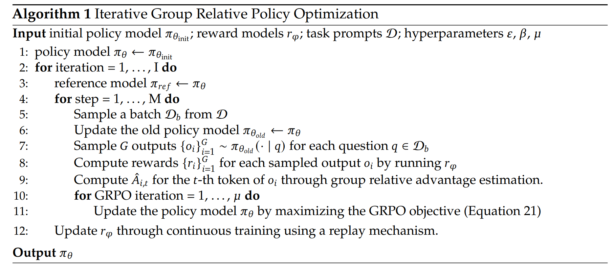
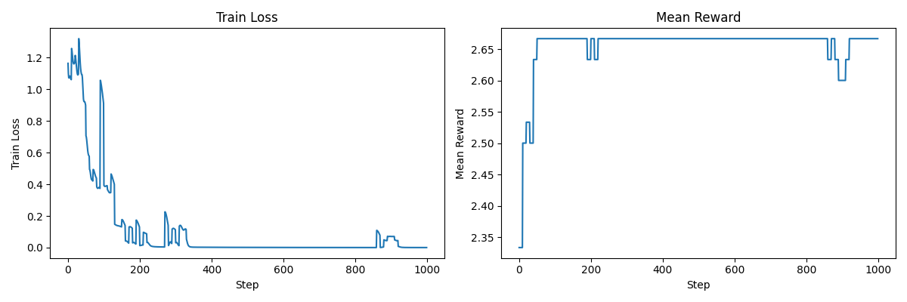
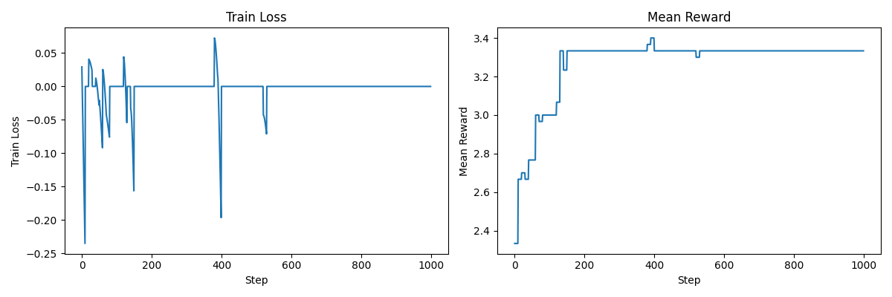
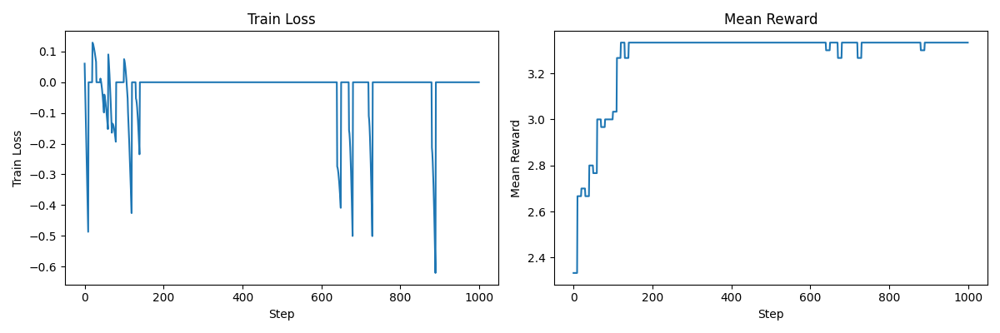

Last lecture: overview of RL from verifiable rewards (policy gradient)

This lecture: deep dive into the mechanics of policy gradient (e.g., GRPO)

**State** s: prompt + generated response so far

**Action** a: generate next token

**Rewards** R: how good the response is; we'll focus on:

- Outcome rewards, which depend on the entire response

- Verifiable rewards, whose computation is deterministic

- Notions of discounting and bootstrapping are less applicable

Example: "... Therefore, the answer is 3 miles."

**Transition probabilities** T(s' | s, a): deterministic s' = s + a

- Can do planning / test-time compute (unlike in robotics)

- States are really made up (different from robotics), so a lot of flexibility

**Policy** π(a | s): just a language model (fine-tuned)

**Rollout/episode/trajectory**: s → a → ... → a → a → R

**Objective**: maximize expected reward E[R]

(where the expectation is taken over prompts s and response tokens a)

For notational simplicity, let *a* denote the entire response.

We want to maximize expected reward with respect to the policy π:

E[R] = ∫ p(s) π(a | s) R(s, a)

Obvious thing to do is to take the gradient:

∇ E[R] = ∫ p(s) ∇ π(a | s) R(s, a)

∇ E[R] = ∫ p(s) π(a | s) ∇ log π(a | s) R(s, a)

∇ E[R] = E[∇ log π(a | s) R(s, a)]

Naive policy gradient:

- Sample prompt s, sample response a ~ π(a | s)

- Update parameters based on ∇ log π(a | s) R(s, a) (same as SFT, but weighted by R(s, a))

Setting: R(s, a) ∈ {0, 1} = whether response is correct or not

- Naive policy gradient only updates on correct responses

- Like SFT, but dataset changing over time as policy changes

Challenge: high noise/variance

In this setting, sparse rewards (few responses get reward 1, most get 0)

In contrast: in RLHF, reward models (learned from pairwise preferences) are more continuous

### Baselines

Recall ∇ E[R] = E[∇ log π(a | s) R(s, a)]

∇ log π(a | s) R(s, a) is an unbiased estimate of ∇ E[R], but maybe there are others with lower variance...

Example: two states

- s1: a1 → reward 11, a2 → reward 9

- s2: a1 → reward 0, a2 → reward 2

Don't want s1 → a2 (reward 9) because a1 is better, want s2 → a2 (reward 2), but 9 > 2

Idea: maximize the baselined reward: E[R - b(s)]

This is just E[R] shifted by a constant E[b(s)] that doesn't depend on the policy π

We update based on ∇ log π(a | s) (R(s, a) - b(s))

What b(s) should we use?

Example: two states

Assuming uniform distribution over (s, a) and |∇ π(a | s)| = 1

Define baseline b(s1) = 10, b(s2) = 1

Variance reduced from 5.323 to 1.155

Optimal b*(s) = E[(∇ π(a | s))^2 R | s] / E[(∇ π(a | s))^2 | s] (for one-parameter models)

This is difficult to compute...

...so heuristic is to use the mean reward:

b(s) = E[R | s]

This is still hard to compute and must be estimated.

### Advantage functions

This choice of b(s) has connections to advantage functions.

- V(s) = E[R | s] = expected reward from state s

- Q(s, a) = E[R | s, a] = expected reward from state s taking action a

(Note: Q and R are the same here, because we're assuming *a* has all actions and we have outcome rewards.)

Definition (advantage): A(s, a) = Q(s, a) - V(s)

Intuition: how much better is action a than expected from state s

If b(s) = E[R | s], then the baselined reward is identical to the advantage!

E[R - b(s)] = A(s, a)

In general:

- Ideal: E[∇ log π(a | s) R(s, a)]

- Estimate: ∇ log π(a | s) δ

There are multiple choices of δ, as we'll see later.

[[CS224R lecture notes]](https://cs224r.stanford.edu/slides/03_cs224r_policy_gradients_2025.pdf)

Group Relative Policy Optimization (GRPO) [DeepSeekMath: Pushing the Limits of Mathematical Reasoning in Open Language Models](https://arxiv.org/pdf/2402.03300.pdf)

- Simplification to PPO that removes the critic (value function)

- Leverages the group structure in the LM setting (multiple responses per prompt), which provides a natural baseline b(s).

Task: sorting n numbers

Prompt: n numbers

Response: n numbers

Reward should capture how close to sorted the response is.

Define a reward that returns the number of positions where the response matches the ground truth.

Define an alternative reward that gives more partial credit.

Note that the second reward function provides more credit to the 3rd response than the first reward function.

Define a simple model that maps prompts to responses

- Assume fixed prompt and response length

- Captures positional information with separate per-position parameters

- Decode each position in the response independently (not autoregressive)

Start with a prompt s

Generate responses a

Compute rewards R of these responses:

Compute deltas δ given the rewards R (for performing the updates)

Compute log probabilities of these responses:

Compute loss so that we can use to update the model parameters

Motivation: in GRPO you'll see ratios: p(a | s) / p_old(a | s)

When you're optimizing, it is important to freeze and not differentiate through p_old

Do it properly:

Sometimes, we can use an explicit KL penalty to regularize the model.

This can be useful if you want RL a new capability into a model, but you don't want it to forget its original capabilities.

KL(p || q) = E_{x ~ p}[log(p(x)/q(x))]

KL(p || q) = E_{x ~ p}[-log(q(x)/p(x))]

KL(p || q) = E_{x ~ p}[q(x)/p(x) - log(q(x)/p(x)) - 1] because E_{x ~ p}[q(x)/p(x)] = 1

Summary:

- Generate responses

- Compute rewards R and δ (rewards, centered rewards, normalized rewards, max rewards)

- Compute log probs of responses

- Compute loss from log probs and δ (naive, unclipped, clipped)

Let's now define the GRPO algorithm.

Let's actually train some models.

Let's start with updating based on raw rewards.

[var/policy_gradient_rewards_naive.txt](var/policy_gradient_rewards_naive.txt)

Looking through the output, you'll see that by the end, we haven't really learned sorting very well (and this is still the training set).

Let's try using centered rewards.

[var/policy_gradient_centered_rewards_naive.txt](var/policy_gradient_centered_rewards_naive.txt)

This seems to help, as:

- Suboptimal rewards get a negative gradient update, and

- If all the responses for a given prompt have the same reward, then we don't update.

Overall, this is better, but we're still getting stuck in local optima.

Finally, let's try normalizing by the standard deviation.

[var/policy_gradient_normalized_rewards_naive.txt](var/policy_gradient_normalized_rewards_naive.txt)

There is not much difference here, and indeed, variants like Dr. GRPO do not perform this normalization to avoid length bias (not an issue here since all responses have the same length. [Understanding R1-Zero-Like Training: A Critical Perspective](https://arxiv.org/abs/2503.20783)

Overall, as you can see, reinforcement learning is not trivial, and you can easily get stuck in suboptimal states.

The hyperparameters could probably be tuned better...

Summary

- Reinforcement learning is the key to surpassing human abilities

- **If** you can measure it, you can optimize it

- Policy gradient framework is conceptually clear, just need baselines to reduce variance

- RL systems is much more complex than pretraining (inference workloads, manage multiple models)

Final two lectures:

- Junyang Lin (Qwen) [Qwen3 Technical Report](https://arxiv.org/abs/2505.09388)

- Mike Lewis (Llama) [The Llama 3 Herd of Models](https://arxiv.org/abs/2407.21783)
